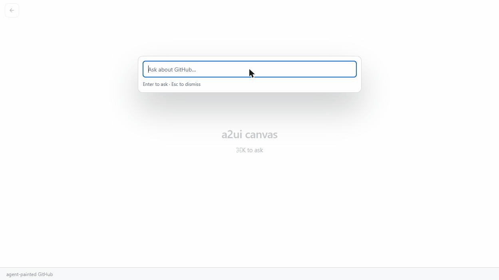

# a2ui-github

**Generative UI for GitHub.** An LLM agent that answers questions about GitHub
not with text, but by painting live UI onto a full-screen canvas — built on the
[A2UI](https://github.com/a2ui-project/a2ui) protocol and GitHub's own
[Primer](https://primer.style/) design system.

Ask *"show me the open pull requests that need review"* and the agent composes
a PR list from a validated catalog of Primer components and streams it onto the
canvas. Everything it paints is interactive: open a PR from that list and the
next surface swaps in — one continuous session, steered by language.



Why a canvas instead of a chat transcript — the paradigm this demo argues — is
laid out in **[THESIS.md](THESIS.md)**.

## How it works

```
   prompt / interaction
          │
          ▼               A2A (streaming)
  client (canvas shell) ◄──────────────► agent (Gemini via ADK)
          │                                      │
   renders through                        reads GitHub via the
  primer-a2ui-adapter                   official MCP server (read-only)
```

The agent generates against the catalog's JSON-Schema contract and every
surface is validated before it reaches the stage; the client renders the same
contract's React implementations.

## The packages

| Package | Role |
| --- | --- |
| [`primer-a2ui-adapter/`](primer-a2ui-adapter/) | The A2UI catalog + React adapter for Primer: 146 component entries and 19 client-side functions, parity-tested against the catalog document. |
| [`client/`](client/) | The web app: the canvas shell (default page), a conventional chat client, and two no-LLM dev pages. The canvas's concepts live in [`client/src/canvas/`](client/src/canvas/). |
| [`agent/`](agent/) | Two Python A2A servers: the live LLM agent (Gemini, read-only GitHub MCP) and a deterministic canned-response agent for token-free testing. |

Each package README is the manual for that package; this one is the map.

## Running it

TypeScript workspaces use **Yarn 4** (via [corepack](https://nodejs.org/api/corepack.html));
the agent is a separate [uv](https://docs.astral.sh/uv/)-managed Python project.

```bash
corepack enable && yarn install
cd agent && uv sync && cp .env.example .env   # then fill in the two keys
```

Two terminals:

```bash
# 1 — the live agent
cd agent && uv run python -m llm_agent --host localhost --port 10003

# 2 — the client
VITE_A2A_SERVER_URL=http://localhost:10003 yarn workspace client run dev
```

Open http://localhost:5173 and ask for something. To try it without any
API keys, see "Working without the LLM" in [`client/README.md`](client/README.md).

## Verifying the repo

```bash
yarn build:all      # build every workspace, dependency order
yarn typecheck:all
yarn lint:all
yarn test:all
yarn verify:all     # build + typecheck + lint + format check + test
```

The agent's suite runs separately: `cd agent && uv run pytest`.

## License

[MIT](LICENSE)
