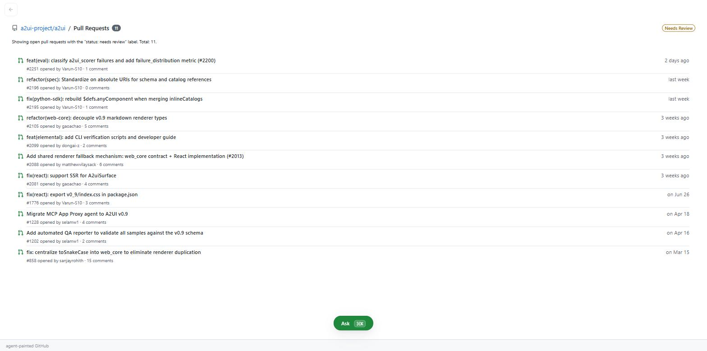
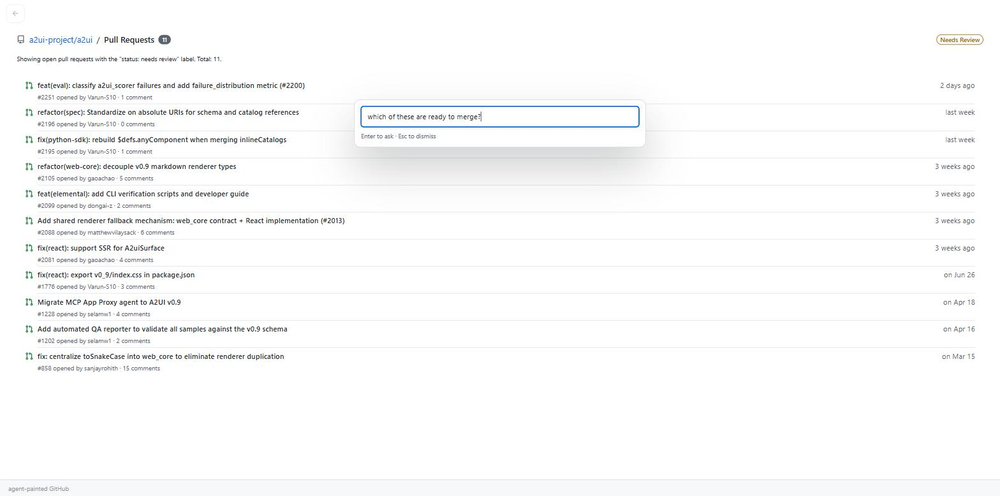
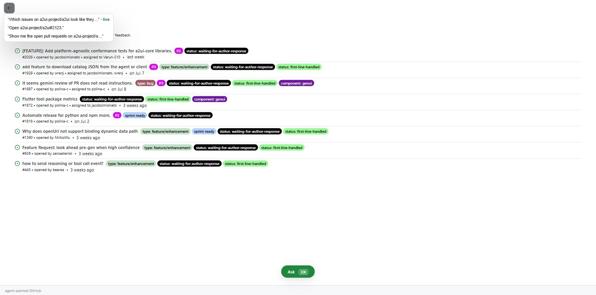
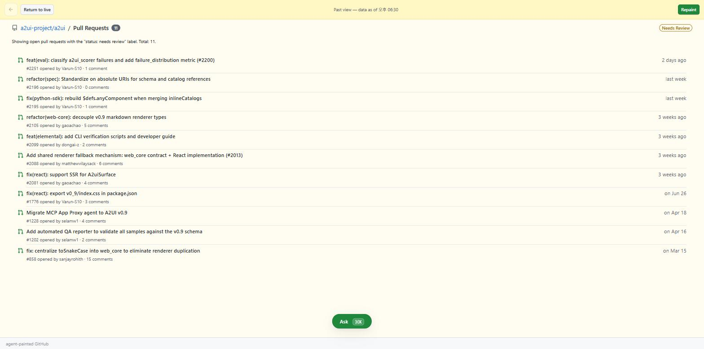
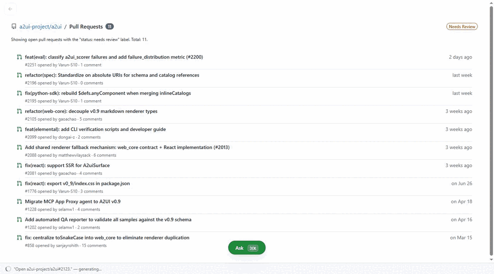

# A Browser for Generative UI

*If an agent generates the interface, chat is the wrong shell for it. A position piece — with a working proof-point in this repository.*

---

1. [The shell we inherited](#1-the-shell-we-inherited)
2. [The claim](#2-the-claim)
3. [This is not chat with a side panel](#3-this-is-not-chat-with-a-side-panel)
4. [Where the frame holds](#4-where-the-frame-holds)
5. [Where the frame breaks](#5-where-the-frame-breaks)
6. [Does it work?](#6-does-it-work)
7. [What's next, and where this points](#7-whats-next-and-where-this-points)
8. [Where this may be wrong](#8-where-this-may-be-wrong)

---

## 1. The shell we inherited

A generative UI is one no developer drew. An agent composes each screen at request time from a catalog of components the client has already approved, and the client renders the description it receives — no arbitrary code crosses the wire. [A2UI](https://github.com/a2ui-project/a2ui) is one protocol for doing this; this repository is a downstream consumer of it.

Whether an agent can compose a good screen is close to settled. It can. The open question is what the screen goes *in*.

Agents reached users through a chat window, so the chat window became the shell. That was inheritance, not design. A transcript is a log — append-only, scrolling, optimized for reading back what was said. Generated UI is not log-shaped. The thing you care about is the current view, and in a transcript it scrolls away exactly like everything else. Ask a follow-up question and the answer arrives *below* the screen it modifies. Scroll up and you are looking at a dead view whose data is an hour old, with nothing telling you so.

The industry noticed the mismatch and bolted a panel onto the side of the transcript. That is a patch, and this document argues the patch is aimed at the wrong layer. The problem is not that the artifact needs somewhere to sit. The problem is that the transcript is still in charge.

## 2. The claim

Here is the position I am taking:

> **If an agent generates pages, you need a browser for them. Chat is not a browser.**

A browser is not a viewer with a URL bar attached. It is a specific machine, and every part of it exists because of a problem that only appears once you start fetching documents you did not write. One document at a time, full-screen. An address bar that is control plane, not content. A history you can walk backwards. And a rendering strategy built entirely around the fact that the document arrives slowly and in pieces.

Every one of those problems reappears the moment an agent starts generating views. They reappear *harder*, because a generated view arrives more slowly than any document and is different every time you ask.

Stated precisely, and this is the sentence the rest of the design falls out of: **the surface is the primary object, and language is the control plane.** A *surface* is one rendered view the agent produced — A2UI's term for its live rendering slot. In this shell it fills the screen, and language is summoned over it when you need it and dismissed when you do not.

That is the frame. The next three sections do three things with it: clear away what it is not, show where it holds, and show where it breaks. The breaks are the interesting part.

## 3. This is not chat with a side panel

**ChatGPT Canvas and Claude Artifacts.** The word *canvas* collides, so this needs saying first. Those products keep the transcript as the primary object and give the artifact a panel beside it. The conversation is the spine; the artifact is an attachment to it. The position here is the inverse: the surface is the spine, and the conversation is demoted to a summonable input with no persistent transcript at all. **Those demote the artifact. This demotes the conversation.** That is not a refinement of the same idea, it is the opposite arrangement of the same two objects — and it produces a different history model, a different interaction cost model, and a different failure mode, all of which follow in §5.

**Notebooks.** The closest honest relative. Jupyter and Observable also treat generated output as the primary object, also keep a history, and also let you go back and re-run. The comparison is flattering and the divergence is real: a notebook's history is a *re-executable log*. Going back means re-running a cell, which recomputes it. Here, going back restores stored state — the view you left, with your scroll position and your half-typed text still in it, because nothing was recomputed. §5b is that distinction in full. The second divergence is that a notebook's cells are authored by the user and merely executed by the machine; here the machine authors the view and the user only states intent.

**"It's a React app whose backend happens to be an LLM."** The deflationary read, and it deserves a straight answer rather than a defensive one. The difference is the catalog. The client ships a fixed vocabulary of components — in this repository, around fifty [Primer](https://primer.style/) leaves — and the agent may compose only from that vocabulary. It cannot ship markup, styles, or code. That constraint is what makes the whole arrangement safe enough to be worth building, and it is checkable: `primer-a2ui-adapter/` is the entire surface area the agent can reach.

It also invites the sharpest objection to generative UI in general — that a catalog is a ceiling, and the bottleneck simply moved from the app developer to the catalog author. The answer is composition. The agent does not pick a component, it composes a tree, and the number of useful screens reachable from fifty composable leaves is not fifty. This repository's agent was never given a "PR review screen"; it builds one, differently each time, out of layout, list, label, and button primitives. The ceiling is real but it is much higher than the objection assumes, and it is a ceiling on *novel widgets*, not on novel screens.

## 4. Where the frame holds

Four browser parts map onto this shell almost without argument. Two terms arrive here and are worth naming, because §5 leans on both. A **paint** is one agent rendering of a surface — everything that turn streamed, treated as a single unit. The **stage** is the slot that holds the live one.

**One document, full-screen → the stage.** A browser shows one page. Not a page and a sidebar of previous pages; one page, occupying the window. The shell does the same: a single stage holds exactly one surface, and it fills the screen like an application rather than sitting in a column. Composition *within* that surface is the agent's job — it has layout components and it uses them. Composition *across* surfaces is not offered, and §8 treats that as a live risk rather than a settled choice.

**The address bar → the palette.** A browser's address bar is the only part of the window that is not content, and it is where intent goes. The shell's equivalent is a command-palette-style input: summoned with a keystroke, spoken to, dismissed. It is not a panel and it does not persist, for the same reason the address bar is one line rather than a third of the window — it is a control, and controls do not deserve permanent real estate proportional to their importance.

Demoting language to a control does not demote it in power. The palette is where every novel intent enters, and it is modality-agnostic in principle: nothing about the design assumes typing.

**History and the back button → the timeline.** Every paint is retained. There is a back button, and holding it reveals a titled list of everything retained — which is Chrome's exact affordance, deliberately. One deviation: because a generated view can be arbitrarily stale in a way a web page usually isn't, a view restored from history carries a banner saying so, and a return-to-live control that jumps to the newest paint from any depth.

**Progressive rendering → the blank-screen problem.** Browsers render partial documents because waiting for the whole thing meant staring at nothing. Generation is slower than any HTTP fetch, so the same problem arrives magnified. The shell inherits the solution — and then, in the one case that matters, inverts it. That is §5d.

## 5. Where the frame breaks

Four parts of the browser transfer cleanly. The next five do not, and this is where the actual work is. In each case the browser's answer is available and wrong, and the reason it is wrong says something about generated interfaces specifically.

### 5a. Stages are nodes, dialogue is edges

A browser's history is a list. Ordered, linear, each entry a page you visited. That model breaks here immediately, because the interesting question about a generated view is not *when* but *why*: which utterance produced it, which button on which earlier surface, which answer to which question.

So history is a graph. Every paint is a node. Every paint also records an **edge** — the typed cause that produced it: an utterance, an action fired on an earlier surface, or an answer to a question the agent asked. The edge names its parent paint. Provenance becomes navigable: a paint can say *"↩ from PR Status & Checks"* and mean it, as a link rather than a caption.

One consequence is worth stating because it is easy to get wrong. Conversation does not get its own nodes. When the agent asks a question, that question is not an entry in the timeline — it is recorded on the edge of the paint that resulted, along with the answer. Dialogue is what connects views; it is not itself a view. A shell that logged both would be a transcript again, wearing a graph.

Order stays strictly chronological and entries never move. The graph is carried by the edges, not by the layout, so history reads as a sequence while remaining navigable as a structure.

### 5b. History is data, not screenshots

Almost every system that offers to show you a past state shows you a picture of one. Screenshots, thumbnails, a re-render from a cached blob. That is the cheap implementation, and it is why "history" in most tools means *look, do not touch*.

Here a past paint is stored as data: its component tree and its data model, as plain JSON. Restoring one rebuilds a real, interactive view. The filter you set is still set. The text you typed is still there. You can go back to a view from twenty minutes ago and keep working in it — sort a table, expand a row, edit a field — because it is not an image of a view, it is a view.

And that local state persists. Edits made inside a restored paint are written back to its stored snapshot: *the state as of the last time you touched it*, not as of when it was created. The agent's content is frozen — what it painted, it painted — but your side of the interaction is yours and keeps accumulating.

This is the distinction §3 drew against notebooks, made concrete. A notebook takes you back by recomputing. Recomputation is exactly what you do not want here, because it costs an LLM call, takes twenty seconds, and produces something *different*.

### 5c. Time travel is a fork, not a portal

The browser's back button is a portal. You go back, the past becomes the present, and acting there continues from there. Forward history gets truncated. That is coherent for documents and incoherent here, because there is a conversation attached and conversations do not rewind.

So going back does not move you. It shows you a past view while the live head stays where it is. Acting from that past view — clicking a button on a surface painted half an hour ago — does not resume the session from that point. It **forks**: a new paint is appended at the head, its edge recording which past paint it came from. Nothing is truncated, nothing is rewritten, and the agent's conversation stays a single line.

The agent is told, explicitly, that the action came from a historical view: which paint it was, when it was painted, and what that snapshot's data currently holds. It refetches rather than assuming the old data still stands. In the verified arc run this is the step where a user parks a twenty-minute-old PR list, clicks a row in it, and gets a fresh detail view at the head carrying a visible causal link back to where the click came from.

The alternative — rewinding the agent's context to match the view — is a portal, and it means the session forgets everything after that point. Whatever that is, it is not time travel; it is undo with extra steps.

### 5d. Hold-and-swap: progressive rendering, inverted

Progressive rendering exists to beat the blank screen. Browsers paint partial documents because the alternative was staring at white while bytes arrived.

Applied naively to generation, it produces something worse than a blank screen. A surface builds itself in front of you over fifteen or twenty seconds — a heading, then a list with three rows, then eight more, then a footer — and everything you are trying to read moves while you read it. Worse, the old view was destroyed at the start to make room, so you spent those seconds with strictly less information than you had before you asked.

So the shell inverts it. When the stage is occupied, a new paint streams **off-stage**. The current surface stays fully visible and fully interactive while the next one is built out of sight, and the swap happens in one step, only after the stream completes and the result validates. A paint that fails validation never reaches the stage at all — it is discarded, and you keep what you had.

Progressive rendering is retained for the one case where it is still right: an empty stage, where there is nothing to protect and watching the thing arrive genuinely beats watching nothing.

The claim in one line: **streaming exists to beat the blank screen; hold-and-swap means the screen is never blank.** It is the shortest way to say that a generative shell should never leave you with less than you started with — and §6 has a recording of it.

### 5e. The cost hierarchy has to be legible

Browsers taught everyone a cost model without ever mentioning it. Typing in a field is free. Clicking a link costs a round-trip. The gap was small enough — milliseconds against tenths of seconds — that nobody needed to be told.

Here the gaps are orders of magnitude, and they are not invisible. Three tiers:

- **Local interaction** — sorting, filtering, expanding, typing. Runs in the client against the surface's own data model. Free, instant, no agent involvement.
- **A surface action** — a button that needs the agent. Costs a generation.
- **An utterance** — the palette. Costs a generation, and unlike the button, the agent has to work out what you meant first.

In the fourteen turns of this repository's verified arc run, a turn took between 7 and 31 seconds end to end, median around 21, with the first component of a paint landing between 4 and 21 seconds in. That is the real number. Against GitHub's own sub-second navigation it is not close.

Two design consequences follow, and both are visible in the shell. The palette is summoned rather than persistent, because a control that expensive should not be the thing your cursor rests on by default — the cheap interactions are *in the surface*, and the surface is what fills the screen. And while a paint is in flight, the tiers are enforced rather than merely priced: local interactions on the current surface stay live, agent-bound buttons are blocked with a status cue instead of silently queueing, and a new utterance cancels the in-flight paint rather than racing it. Last intent wins, because after twenty seconds of waiting the user has usually changed their mind, and a shell that made them wait for an answer they no longer want is doing the wrong thing efficiently.

## 6. Does it work?

The shell in this repository runs the full eight-beat "maintainer's morning" arc end to end, in one continuous session, against the live `a2ui-project/a2ui` repository — real GitHub data through a read-only MCP connection, a real LLM on every turn, twelve paints, no scripted responses. The run is recorded in `agent/recordings/arc/`; the graded journals are in [`_dev/docs/arc-verification.md`](_dev/docs/arc-verification.md) and [`_dev/docs/beat-verification.md`](_dev/docs/beat-verification.md).

What I take that to establish, and no more: **the paradigm is demonstrated at single-agent scale.** One agent, one catalog, one stage. Everything in §7 — composition across surfaces, multiple agents, an orchestrator above them — is argued for, not shown. Those are the claims a reader should treat as asserted, because they are.

*The stage: one surface, full-screen, with the thin status region that carries agent progress.*

*The palette, summoned over a surface that stays visible underneath it.*

*Press the back control and every retained paint is listed by title — agent-authored where supplied, derived from the paint's cause otherwise, as in these replayed recordings. The newest is marked live.*

*A restored paint: fully interactive, explicitly marked as past, one control back to live.*

*Hold-and-swap (§5d): the pull-request list stays fully visible and interactive while the next paint is built off-stage — the status strip reads “generating…” throughout — then the detail view swaps in, in one step.*

## 7. What's next, and where this points

The browser frame did more than describe what got built. It kept pointing at parts that are missing, and the roadmap below is mostly a list of browser affordances this shell does not have yet. That is a good sign for the frame and an honest statement about the state of the work: this is a first stone, not a finished building.

### What's next

*Roadmap. These are things this project intends to build.*

**Tabs — composition across surfaces.** The single stage is the shell's most restrictive constraint and the first thing to go. Real work is comparative: the pull request beside the issue it closes, the review beside the diff. A browser solved this with tabs and then with tiling, and a generative canvas needs a version of it in which the *agent* is a participant — it should be able to paint a second surface alongside the first because the request warranted two, not because the user arranged panes by hand. This is the single largest gap between what exists and what the position implies.

**Multiple origins — more than one agent.** A browser talks to every server on the internet, and its trust model is what makes that survivable. This shell talks to exactly one agent. The next step is more than one painting into the same space — a GitHub agent and something else entirely, sharing a stage, distinguishable to the user. The catalog is what makes it plausible: an agent's entire reach is a fixed component vocabulary, so admitting a second one does not widen the blast radius the way admitting a second script would.

**Deep history.** Retention is currently a fixed-size ring — the last fifty paints, in full. Beyond that, a paint should degrade to a metadata-only stub whose title and cause survive, and whose *restoration is a repaint*: ask again rather than store forever. History that thins out instead of ending.

**Pinnable splits, and input that isn't text.** Two smaller items. Snapshots worth keeping should be pinnable out of the ring. And nothing in the design assumes a keyboard — the palette is a control, and speech is a control that fits the same slot.

### Where this points

*Direction. Less committed, and further out.*

Above several agents, something has to decide which one is being addressed, which gets the stage, and how a request that spans two of them is split. That is an **orchestrator** — a model whose job is not to paint anything but to route intent and arbitrate the canvas. In browser terms it is the layer above the browser: the thing that decides what gets a window at all.

I think that layer is where generative UI stops being a better interface for one application and starts being a plausible shell for many, and I think it arrives before the interface details below it are settled. The order in which those pieces land is not obvious to me, and this document is not going to pretend otherwise.

## 8. Where this may be wrong

The frame is an analogy, and the useful thing to do with an analogy is say where you expect it to snap. These are falsifiers, not caveats — each names an observation that would count against the position.

**The single stage may be the wrong constraint, and multi-surface may not fix it.** §7 treats composition as the next feature. The failure case is that it is not a feature but a correction: users reach for a second surface in the first session, always, and the right model was panes from the start. If that is true, "canvas" degenerates into a window manager with a language input, and the interesting claims about a single primary surface were never load-bearing. *What would show it: users wanting two things on screen immediately and constantly, rather than occasionally.*

**Latency may lose to a deterministic application, permanently.** §5e's numbers are real: a median of about 21 seconds against GitHub's sub-second navigation. Hold-and-swap defeats the blank screen; it does not defeat the wait. Faster models will narrow this, but generation may never reach interactive speed for views this size, in which case the paradigm is right only for low-frequency, high-value screens — a much smaller claim than "this is the shell for generative UI." *What would show it: users routinely abandoning the shell mid-task for the deterministic app that does the same thing in a second.*

**Language may be the wrong control plane for repeated intent.** This is the objection I find hardest to answer, because it is not a failure of the implementation. The palette is excellent for novel intent and poor for the fifth time you want the same list. Users will want a button. Which means the agent must paint persistent navigation — and at that point you have an application again, generated once and thereafter static, with language relegated to the long tail. That would not make the shell useless. It would make the thesis much narrower than stated: not *the* shell for generative UI, but the entry point to a generated app. *What would show it: users converging on a stable set of surfaces and wanting them addressable without speaking.*

**Cross-visit consistency is an open problem, not a solved one.** Ask for the same view twice and you may get two different compositions, both good. Browsers work partly because one URL yields one page, and this shell has no equivalent guarantee. `SPEC.md` §2 flags an agent-side "template memory" and explicitly defers it; that deferral is this problem, still open. I do not know yet whether users build a stable mental model anyway — the arc run is too short to say — or whether the variance is corrosive in a way that only shows up over weeks.

One thing that is deliberately *not* on this list. The verified run had failures before it went green, and the notable ones were transport and data fabrication — the agent stating things it had not fetched. That is a serious problem and it is an agent-quality problem: it would exist behind a chat window, a form, or a hand-built application, and nothing about the shell causes or cures it. It is filed under agent correctness rather than here on purpose, and the journals linked in §6 are open if you want to judge whether that is convenient or true.

---

*Jioh In — 2026-08-15. Written against A2UI v0.9.1; the implementation it refers to is in this repository.*
