# Beat verification — task 7.7

The working record for task 7.7: the rubric each beat is graded against, and per beat a
round-by-round account of what was observed, what it violated, and which lever fixed it.
Spec: `_dev/docs/spec/task-7.7-beat-verification.md`. Beats: `SPEC.md` §3.1.

## How these rubrics work

The screenshots in `assets/` are **reference, not template**. They record what a person needs on a
given screen — which facts let them decide, what they can act on — not what the surface should look
like. The agent re-composes each surface; two runs of the same prompt may differ and both be good.

So a rubric grades five things and nothing else:

1. **Intent fit** — does the surface serve what was asked.
2. **Data truth** — every value came from a tool call in that turn; nothing invented.
3. **Information sufficiency** — the facts needed to act are present.
4. **Interactivity** — affordances exist, and each is the right kind (local function vs server
   action). Nothing interactive-looking is inert.
5. **Composition quality** — catalog-valid, legible hierarchy, no empty or placeholder sections.

A rubric never requires a particular component, layout, ordering, or field set, and never requires
resemblance to the reference. Each beat's **Not required** list exists to stop over-grading.

`local` = client-side `functionCall`, costs no model turn. `server` = `event`, an agent round-trip.
Every server action must carry context identifying its target; an action whose context cannot say
*which* PR/issue/repo it refers to is a failure even though it validates.

## Reference index

| Beat | Reference |
|---|---|
| 1 | `assets/beat-1-pr-list.png` |
| 2 | `assets/beat-2-pr-header.png`, `-pr-timeline.png`, `-pr-checks-comment-bottom.png`, `-files-changed-tab.png`, `-checks-tab.png`, `-commits-tab.png` |
| 3 | `assets/beat-3-review-form.png` (different repo, light theme — shape reference only) |
| 4 | `assets/beat-4-issue-list.png` |
| 5 | `assets/beat-5-issue-detail.png` |
| 6 | `assets/beat-6-repo-landing-top.png`, `-middle.png`, `-bottom.png` |
| 7 | `assets/beat-7-user-profile-base.png`, `-history.png` |
| 8 | `assets/beat-8-notifications.png` |

---

## Round 0 — before any live turn

Zero LLM calls. Three items, plus one finding.

**Strict example gate.** `agent/tests/test_knowledge_examples.py` now validates through the live
agent's `validate_surface` rather than the deterministic agent's non-strict partial probe. Every
example is a complete surface, so the strict validator is the right one. The four existing examples
pass unchanged — no latent defect. The strengthening is real rather than a call swap: injecting each
defect class into a known-good example, the old gate passed all three and the new one catches all
three.

| Injected defect | old `validate_payload` | new `validate_surface` |
|---|---|---|
| orphaned component | passes | raises — not reachable from `root` |
| unresolvable binding | passes | raises — binding does not resolve |
| missing `createSurface` | passes | raises — incomplete surface |

**Client data-model instrumentation.** `client/src/a2a/dataModelSize.ts` measures the serialized
payload — total bytes, surface count, per-surface breakdown largest-first — and logs one
`[a2ui:datamodel]` line per send. It hooks `clientDataModelMetadata` in `messages.ts`, the single
choke point both send paths funnel through, so text sends and action sends are both covered. Sizes
get recorded per beat below.

**Rubrics.** Written from the reference screenshots and approved before any live run.

**Baseline.** `yarn verify:all` green (adapter 2475 tests, client 529); `uv run pytest` green (186).
Note that `verify:all` covers the yarn workspaces only — the agent is uv-managed and runs separately.

### Finding — stale adapter build masquerades as a product defect

`client/tests/basic-functions.test.tsx` failed 5 of 6, all function-evaluation paths. Root cause:
the client resolves `primer-a2ui-adapter` through its **gitignored `dist/`**, which predated task
7.9 — the runtime catalog carried only the 5 original functions, so the invoker raised "Function not
found in catalog" for every adopted one. Source was correct throughout; `yarn test:all` runs only
`test` across workspaces and never builds, while `yarn verify:all` builds first. Rebuilding the
adapter turned all 6 green. No code was wrong.

Recorded because it is a live trap for this task: a local function added for beat 3 will not resolve
in the browser until the adapter is rebuilt, and the symptom — a function the surface names but the
client cannot find — is indistinguishable from the agent emitting a bad function name. **Any beat
round following an adapter change rebuilds before the run**, and `verify:all` is the gate, never
`test:all`.

---

## Beat 1 — PR list

> "Show me the open pull requests on a2ui-project/a2ui that need review."

**Intent:** a maintainer scanning what is waiting on them.

- **Data truth** — every row is a real open PR of that repository, fetched this turn. No invented
  numbers, titles, authors or counts.
- **Sufficiency** — each row carries enough to decide whether to open it: identity (number and
  title), who raised it, and recent activity. The size of the result set is conveyed somehow.
- **State** — review/CI state is *conveyed*: per row when it varies, **at surface level when the
  filter makes it uniform**. Fetching per-item detail for a list is explicitly not required.
  *(Amended after round 4. The original line demanded per-row state, which conflicts with the
  tool-economy rule: GitHub's search API returns no review decision or check status, so per-row
  state costs two extra calls per row. It is also redundant when the list is already filtered to
  `review:required` — every row shares one state, and the surface says it once.)*
- **Composition** — an enumerable, scannable structure with a consistent per-row shape; not a prose
  paragraph and not one text blob. No empty sections.
- **Interactivity** — a row resolves to a **server** action carrying its PR number. Reordering or
  narrowing rows already fetched is **local**.
- **Reading of "need review"** — the item's actual review state (review requested, not yet
  approved), not a repository label whose name happens to match. The broad reading is the one a
  maintainer means; a label captures a fraction of it.
- **Not required** — GitHub's row layout, labels, task-list progress, linked-issue counts, an exact
  field set, or a server-side "needs review" filter (per-row review state is sufficient).

### Rounds — approved at R4

| R1 (lite) | R1 (flash) | R2 | R3 | R4 ✓ |
|---|---|---|---|---|
| no surface | 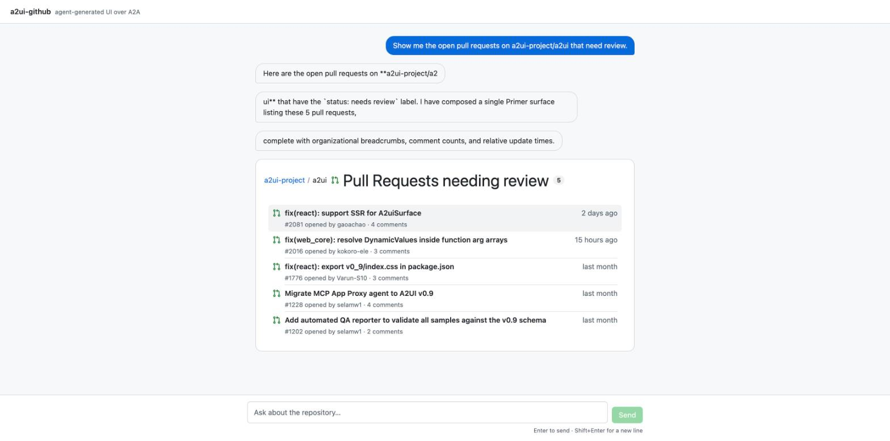 | 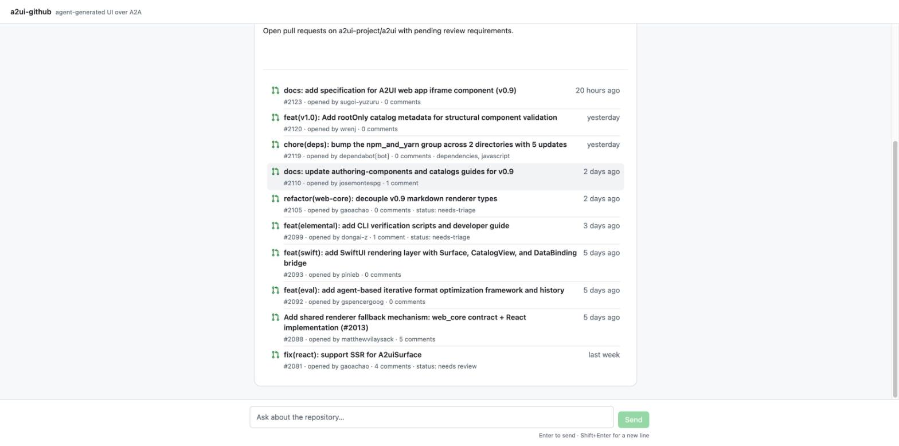 | 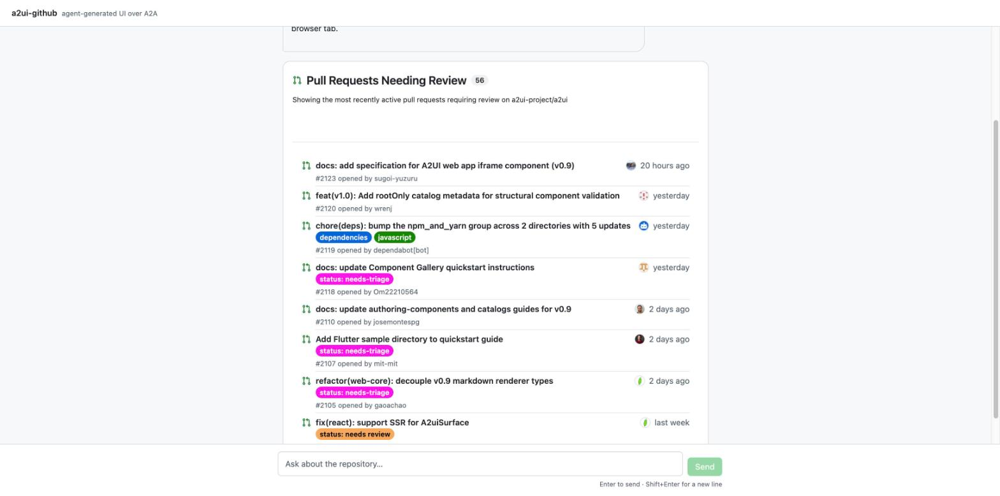 | 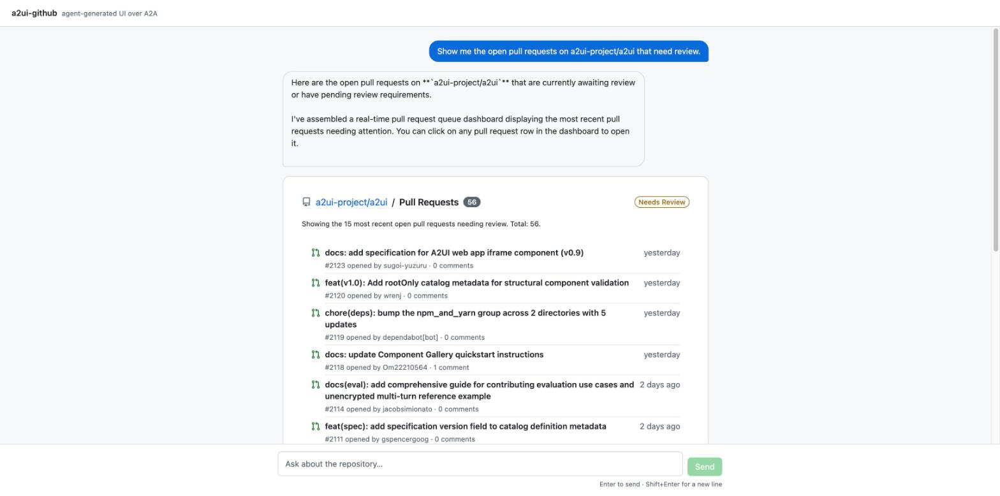 |

**R1 — `gemini-3.5-flash-lite`, no surface.** Both attempts emitted the same malformed JSON: the
`updateDataModel` message object closed with `]` instead of `}`. Everything else was well-formed.
The parser's incremental heal does not repair a wrong-*type* bracket. Two identical attempts
triggered the model-ceiling diagnostic; `gemini-3.5-flash` produced a valid surface on attempt 1,
same prompt. **Lever: model default → `gemini-3.5-flash`.** Lite cannot reliably close ~7 KB of
nested JSON.

Two client defects surfaced here, both fixed before continuing:

| Observed | Cause |
|---|---|
| Turn vanished entirely — surface removed, nothing rendered, no console error | The agent tears down the half-built surface and apologises as a `TextPart`; the client read only A2UI DataParts, so the apology was dropped. `ChatView` had no transcript kind for agent text. |
| (after the fix) prose split mid-word across bubbles | Prose streams in chunks; one bubble was appended per chunk. Chunks of one send now accumulate into a single entry. |

**R1 (flash) — 2 rubric misses.** Rows inert (`ActionList` with no action); "need review" read as the
repo's literal `status: needs review` label, 5 of 69. Title also oversized. **Levers:** prompt rule
reading intent by state rather than by a same-named label; brand-doc line keeping the surface title
at `small`/`medium` (*"a surface is a panel inside a conversation, not a standalone web page"*).

**R2 — row action fixed and proven live.** Template over `/prs`, `event: open-pull-request` carrying
`{"number": {"path": "number"}}`; clicking a row reached the agent with `number: 2093`. Counters
verified against the search API: 56 `review:required`, 69 open — both exact. Remaining: no per-row
state. New: an `UnderlineNav` rendered as an empty landmark (logged in `deferred-catalog-work.md`),
and its tabs carried no action.

**R3 — regression.** Fixing the *example* to show per-row state backfired: the model took the
prompt's sanctioned escape hatch and unrolled the rows (97 components, no data binding), then
switched the row action to `functionCall: openUrl` — navigating out to github.com, which defeats
`SPEC.md:16` ("agent round-trip, generative on each navigation") and makes any follow-up beat
impossible. The prompt beat the example.

**R4 — approved.** **Levers:** brand-doc rule that navigating to anything the agent could compose is
an `event`, never `openUrl` (reserved for genuinely external destinations); prompt rule making the
bound template the default and unrolling the exception; brand-doc rule against emitting unwired
navigation — which also removed the empty-nav gap. Result: 18 components, template over `/prs`,
`event` action, no dead nav.

The last open line — per-row state — was **not** an agent defect. It was a bad rubric line, amended
above: the search API carries no review decision or check status, so per-row state costs two extra
calls per row against an explicit tool-economy rule, and it is redundant when the whole list shares
one state. The agent was right in all four rounds.

**Client data model:** 2095 B, 1 surface (`prs-needing-review` 2042 B) on the action send.

**Approved surface** → `agent/knowledge/examples/pr-review-queue.json` (data trimmed to 4 rows; the
idiom, not the volume, is the lesson). Retires `review-queue-status-list.json` per spec decision 11.

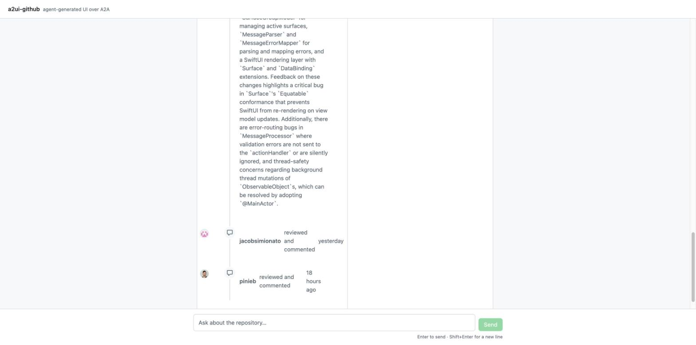

## Beat 2 — PR detail

> "Open a2ui-project/a2ui#2123."

**Intent:** enough depth to judge the PR without leaving the surface.

- **Data truth** — title, number, state, author, branches, body, review and check state all fetched.
- **Sufficiency** — the seven of `SPEC.md` §3.2 are each **represented at summary depth**: the
  changed files as a path list carrying per-file ±, the checks as a tally of outcomes, the timeline
  as its content-bearing entries with the total volume stated. An element may be condensed; none may
  be absent. Depth past the summary is offered through an affordance, not rendered up front.
  *(Amended before round 5. The original line asked only that each element be "present in some
  form", which a transcription of GitHub's page satisfies maximally — and that is the wrong target.
  The static page stacks everything because one page must serve every visitor who ever loads it; a
  generative surface composes for the request. Reproducing that architecture spends the user's
  streaming time and the agent's tokens to arrive somewhere they could already have gone, which is
  the whole argument for generating the UI at all. The seven stay a floor so grading stays
  checkable — only depth is discretionary. `SPEC.md` §3.2 carries the same amendment. The reason is
  independent of any round's result: it held before R4 ran and would hold had R4 passed.)*
- **Composition** — the markdown body is **decomposed into catalog primitives** (headings, text,
  lists, links), not dumped as one string, and bounded to what conveys the change — a contributor
  checklist and link definitions are not that. Sections are distinguishable. No wall of prose and no
  unrendered markup or HTML entities.
- **Interactivity** — at least one **server** action that advances the flow, carrying PR context.
  Expand/collapse and "show more" are **local**.
- **Not required** — tabs, a diff view, syntax colouring, check annotations, sidebar ordering.

### Rounds — CLOSED at R8, accepted with known defects (not rubric-approved)

| R1 | R2 | R3 | R4 (2.5-flash probe) | R5 | R6 | R7 | R8 |
|---|---|---|---|---|---|---|---|
| 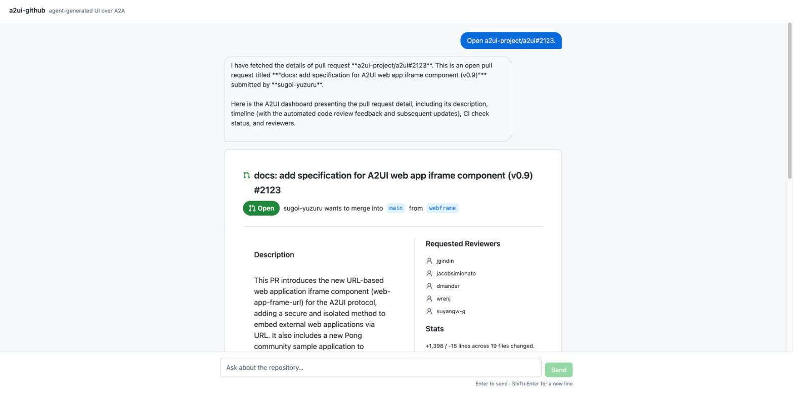 | 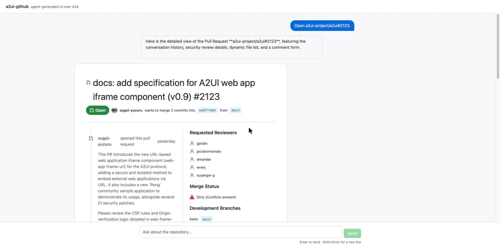 | 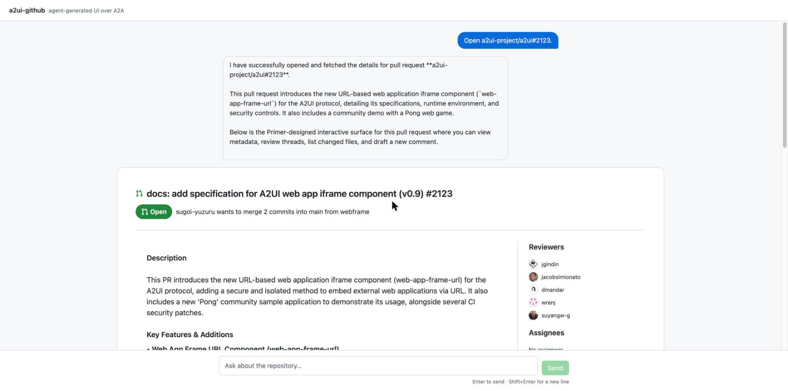 | 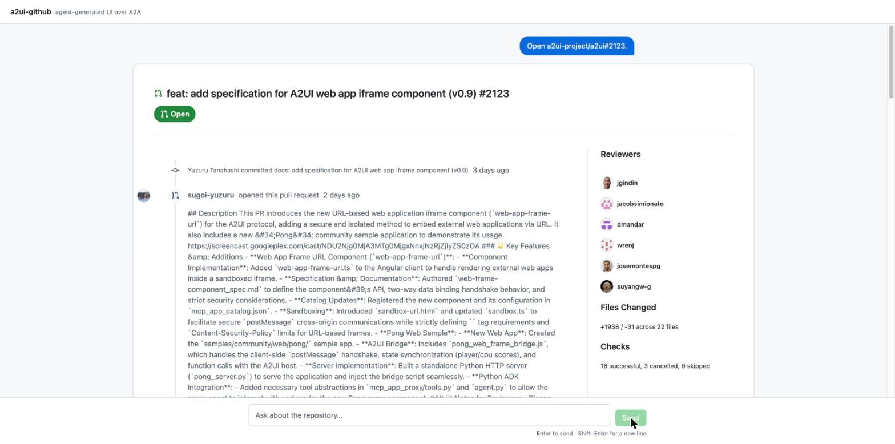 | 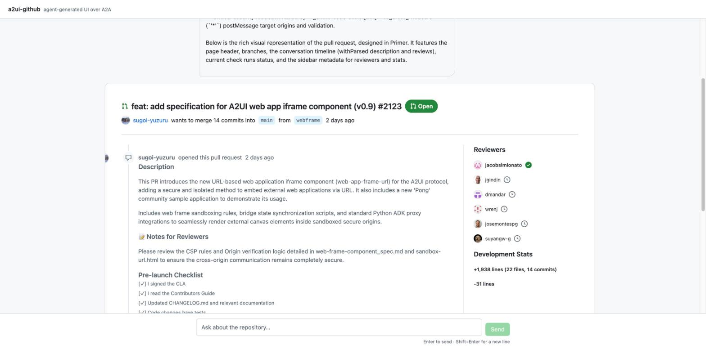 | 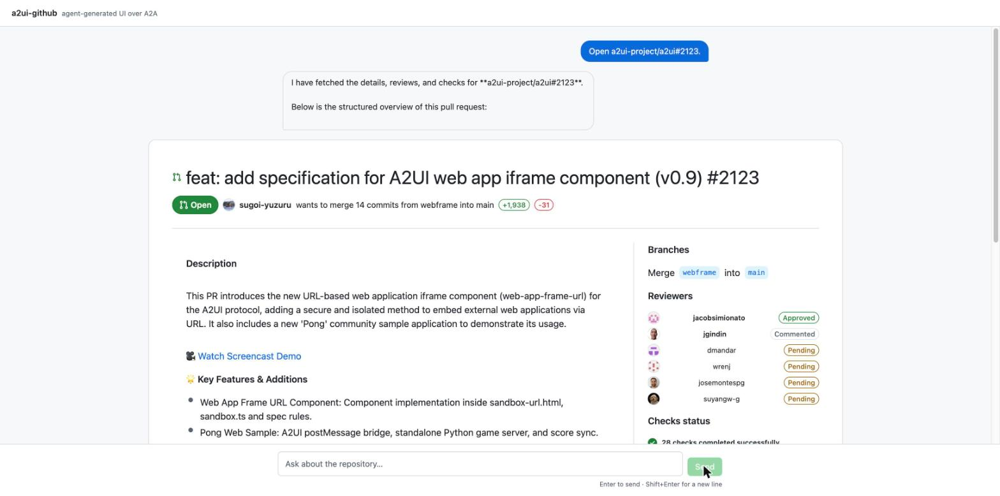 | 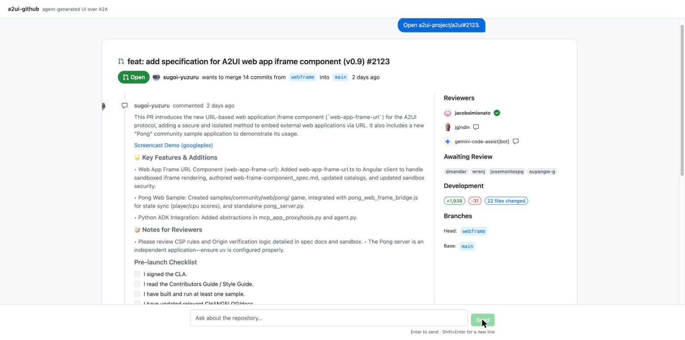 | 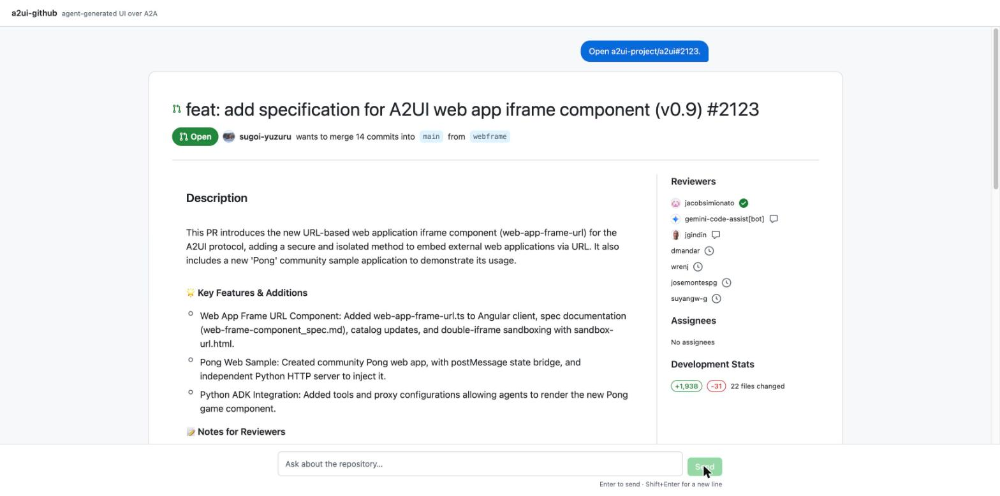 |
| | 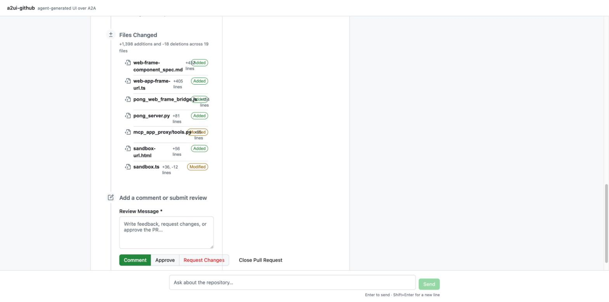 | 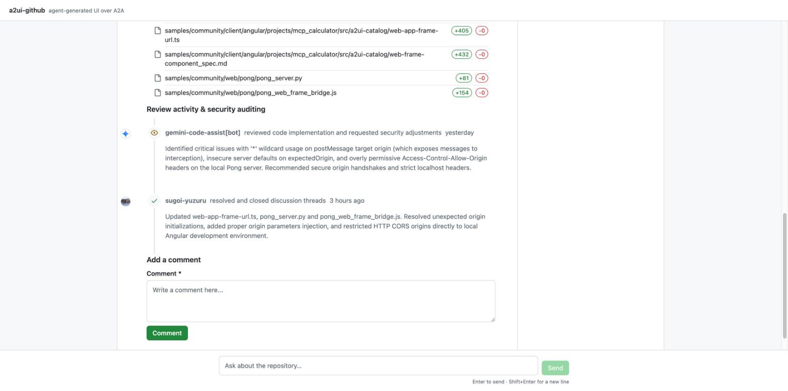 | | 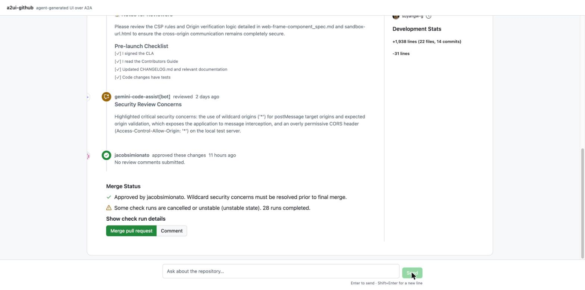 | 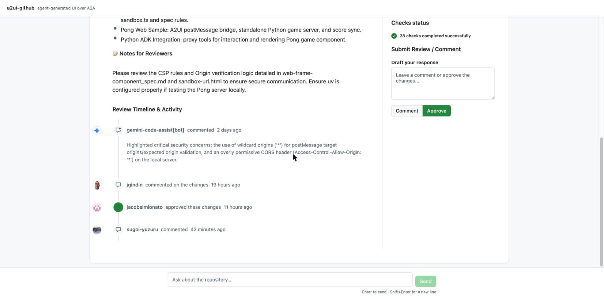 | 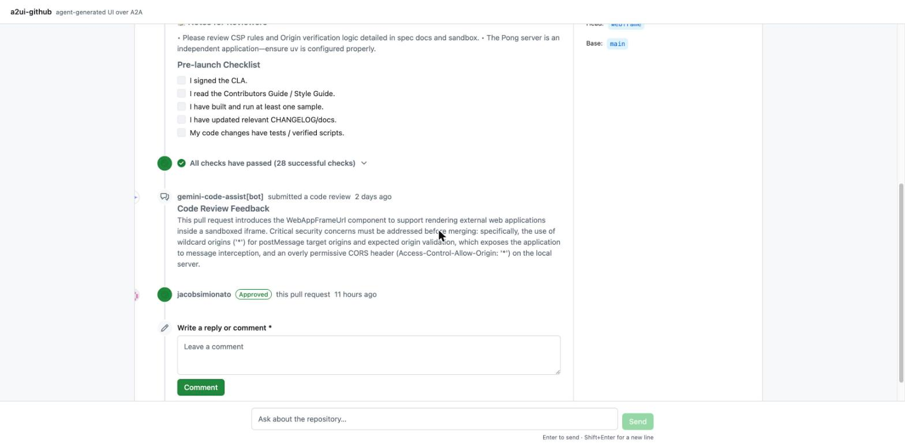 | 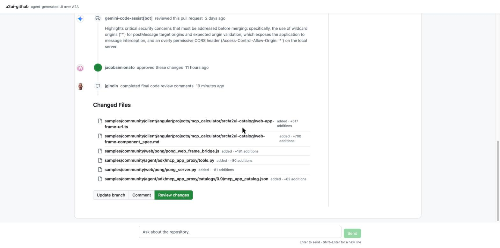 |

**R1 — 4 defects.** Valid on attempt 1 with 8 MCP calls (the sanctioned "drilling into one PR takes
several calls" path). `PageLayout` + `Timeline` + `StateLabel` composed sensibly, but: the markdown
body was one 2 KB `Text` blob; no changed-files list, only "+1,398 / -18 across 19 files"; **zero
actions** anywhere; and the content column wrapped prose at ~8 words.

The narrow column was **not** the agent's fault. `.chat-thread` caps every turn at 768 px, so a
two-column `PageLayout` gets ~400 px of content and ~250 px of pane. That is right for a transcript
and wrong for a generated application view — the constraint Phase 8's canvas exists to remove.
**Levers:** brand-doc rule to decompose a markdown body into components (headings, paragraphs,
lists, links) because there is no markdown component and the agent *is* its renderer; brand-doc rule
that a detail surface offers its next step as an action; prompt rule requiring the changed-files
list; and a client CSS stopgap widening surface turns past the transcript.

**R2 — three fixed, two new.** Markdown decomposed, files list present, four wired actions
(comment / approve / request-changes / close, each carrying `pr_number` and a bound body). But the
branch direction was **inverted** — "into `webframe` from `main`", claiming the change flows the
wrong way — and the file rows collided, "+422 lines" overprinting its `Added` chip.

The width fix was a **no-op**: `width: min(1200px, 100%)` inside a 768 px parent resolves to 768 px.
Replaced with `min(1200px, calc(100vw - 32px))` plus a centring transform, which escapes the parent.
**Levers:** the corrected CSS, and a prompt rule stating a PR merges its HEAD into its BASE.

**R3 — direction, markdown and layout all correct.** Full-width surface, full file paths with ±
chips and no collisions, description decomposed under real headings, one `submit-pr-comment` action
carrying `pr_number` and a bound draft. Five of `SPEC.md` §3.2's seven present.

Two regressed *out*: **CI checks** and **review/merge state**. R3 called `get`, `get_comments`,
`get_files`, `get_review_comments`, `get_reviews` — but not `get_status`/`get_check_runs`, which R2
had called. The included subset oscillates between runs because nothing states what a PR detail must
contain. **Lever:** a prompt rule enumerating all seven required elements explicitly.

**R4 — first attempt blocked, then run on `gemini-2.5-flash` as a downward-tier probe. Grades
nothing.** The credit exhaustion (`429 RESOURCE_EXHAUSTED`) that first blocked it did confirm one
thing: the client rendered *"the language model is temporarily unavailable"* rather than a blank
turn — the round-0 fix working on a failure mode it was not written for.

Re-run after the top-up on `gemini-2.5-flash` rather than the committed `gemini-3.5-flash`, so its
verdict is not a verdict on the seven-element rule — the model is the confound, and spec decision 9
spends ladder turns going *up* a tier, not down. Recorded as a model finding.

| Observed | Against |
|---|---|
| 3m24s to first token, then attempt 1 died on `MAX_TOKENS` at 43,728 chars with no complete surface | thinking tokens draw on the same output budget; attempt 2 recovered, ~6.5 min wall-clock for the turn |
| description dumped as one raw blob — `##`, `**`, `- [ ]` unrendered, `&#34;`/`&amp;` entities leaking | Composition |
| changed files as `+1938 / -31 across 22 files`, no path list — R1's defect verbatim | Sufficiency |
| branches absent entirely; no mergeable/blocked state | Sufficiency (metadata, review state) |
| zero actions — the interactive tree holds only the chat box and Send | Interactivity |
| CI checks present (`16 successful, 3 cancelled, 9 skipped`), reviewers present, timeline rich | the one element R3 lost came back |

Six MCP calls including `get_check_runs`. So the tier that recovered checks simultaneously lost three
elements R3 had — slower, truncation-prone, and below the demo bar on this evidence. **The
seven-element rule remains unverified.**

The timeline it did render — 40+ rows, most of them content-free `sugoi-yuzuru commented on this
pull request` with no body — is what prompted the rubric amendment above. "Timeline present" passed
while "long content is bounded" was violated in spirit, which is the tell that the line was grading
the wrong thing.

### The frame was wrong, not just the rubric

Between R4 and R5 the lever itself was re-examined and rejected. `SCOPE_DESCRIPTION` had accumulated
a screen definition — *"a pull-request detail carries all seven of… the paths, each with additions
and deletions, as a list rather than only an aggregate line total"* — added as R3's lever. That is an
expert system: a hand-authored `if detail then render these seven`, which a static page serves faster
and more reliably than a model can. It also contradicts `SPEC.md` §1, *"don't over-determine the
agent… less dev-specified logic than today's apps, not more."*

The structural cause was that **7.1 shipped no home for domain knowledge.** `brand-guidance.md`
declares its own charter — Primer mechanics only, explicitly *"no domain/triage instructions (what a
given screen should say)"* — and holds to it. So when a round exposed a missing element, the only
reachable lever was to prescribe the screen, because there was nowhere to write what a pull request
*is*.

**Levers (all applied together, per decision 6):**

- **New artifact `agent/knowledge/github-domain.md`** — a third 7.1 knowledge doc, declarative
  register, carrying facts and the decisions that hinge on them and never what a screen contains:
  head-into-base direction, mergeability as three independent gates, review verdicts vs comments and
  latest-per-reviewer, the three comment kinds, bots outnumbering humans, commit statuses *and* check
  runs both on the head SHA, `skipped`/`cancelled` not being failures, issues and PRs sharing one
  number space, labels as local conventions, what stalling actually is, notification `reason`.
  Loaded by `load_domain_knowledge()` and joined into the workflow slot.
- **Deleted from `SCOPE_DESCRIPTION`:** the seven-element sentence, outright, with nothing replacing
  it. Branch direction and the label-vs-state reading **moved** to the domain doc as facts. Tool
  economy stayed — it is about using tools, not about screens.
- The rubric amendment above, and the `SPEC.md` §3.2 depth principle.

Cost noted honestly: removing the enumeration risks the R2/R3 oscillation returning. The discipline
is that the answer is then better domain knowledge, not re-enumeration.

**R5 — the reframe holds; four defects.** `gemini-3.5-flash`, valid on **attempt 1 in 1m48s** (vs
6.5 min and a truncation on the 2.5 probe). Four calls: `get`, then `get_reviews` / `get_comments` /
`get_check_runs`.

What the domain doc produced with the prescriptive rules *deleted*:

| Emitted | Traced to |
|---|---|
| "sugoi-yuzuru wants to merge 14 commits into `main` from `webframe`" | head-into-base fact — the instruction that used to say this was removed |
| a **Merge Status** section synthesising conflicts + checks + reviews, unprompted | "three independent conditions gate a merge" |
| reviewers split by state — approved carries a check, the other five a pending clock | "requested and reviewed are disjoint states" |
| checks as a tally + a `Show check run details` disclosure rather than a dump | summary depth, unprescribed |
| timeline condensed to the two content-bearing reviews; bot review labelled as a bot | "bots can outnumber the human conversation" |

Defects:

| Observed | Against |
|---|---|
| Pre-launch Checklist rendered `[✓]` on all four items; the source body has `- [ ]` on all four. A description paragraph ("Includes web frame sandboxing rules, bridge state synchronization scripts…") appears **nowhere** in the source | Data truth |
| changed files still aggregate-only; `get_files` not called at all this round | Sufficiency |
| "Merge pull request" as the primary button — implies a mutation the agent structurally cannot perform (`SPEC.md` §3 read-only) | Interactivity |
| **zero wired actions**: "Merge pull request", "Comment" and "Show check run details" all inert; the only live control is an author `Link` out to github.com, which the brand doc's own `openUrl` rule forbids | Interactivity |
| a prose preamble above the surface duplicating it and narrating its own composition, raw markdown unrendered in the bubble | ROLE ("never answer in prose when a surface would serve better") |

The first is the **sharp edge of the summary-depth change**: sanctioning condensation invited the
model to author text on the source's behalf, and it flipped a checklist's state. Worse than R4's wall
of prose, which was at least true.

**Levers for R6** — two, both in `ROLE_DESCRIPTION`, since data fidelity and write capability are
facts about *this agent* rather than about GitHub, keeping the domain doc purely factual:

1. **Condensing vs authoring** — shortening a description to its substance is fair; writing a
   sentence its author did not write is not; the state of a thing (a checklist's boxes, a verdict, a
   conclusion) is data reported, never prose smoothed over.
2. **Read-only capability** — every tool is read-only, so an affordance claiming to merge, approve,
   post or close is a promise that cannot be kept; where that is the real next step, compose it and
   stop at the confirm boundary (`SPEC.md` §3).

Deliberately **not** levered: the changed-files miss (the operational line already says drilling in
costs several calls — adding a rule after one round is how the expert system grew last time), and
the prose preamble (likely downstream of the same over-narration instinct as defect 1).

**Flagged, not fixed** (decision 2 — rubrics grade information architecture and interaction, never
visual fidelity): `TimelineAvatar` renders as half-circles clipped at the surface's left edge. Three
compounding layers, only one of them the component, logged with the full diagnosis in
`deferred-catalog-work.md`. Not an agent defect.

**R6 — both levers landed.** Valid attempt 1, 1m29s, three calls. The fabricated checklist is gone;
"Merge pull request" is replaced by a real **compose-and-confirm** — a `Draft your response`
textarea bound to `/review/body` with Comment and Approve, both carrying a server `event`
`submit-review` with `pullNumber`, `reviewType` and the bound body. Reviewers gained explicit
verdicts (Approved / Commented / Pending ×4). New: **"28 checks completed successfully"** — false,
the 28 are 16 successful + 3 cancelled + 9 skipped, and the merge state R5 synthesised disappeared.
Changed files still absent; prose preamble still present.

**R7 — one lever of three landed. Stopped here.** Valid attempt 1, four calls.

| Lever | Result |
|---|---|
| ROLE: the surface is the answer, no preamble | **worked** — no text bubble at all, the surface is the whole response |
| domain: a non-failure is not a success; a mix is `unstable` | **failed** — "All checks have passed (28 successful checks)", worse phrasing than R6 |
| domain: files and commits are separate reads, not part of the PR object | **failed** — `get_files` still never called; "22 files changed" is the PR object's own aggregate |

The checklist is now the round's best result: five `Checkbox` components, `checked: false` **and
`disabled: true`** — faithful to the source *and* correctly non-interactive, the read-only fact
generalising past actions into rendering. Reviewers split into verdicts plus an explicit "Awaiting
Review" group. One server `event` (`post-comment`) carrying `pullNumber`/`owner`/`repo`.

**Stop, per decision 6** — two consecutive rounds producing the same defect, and a lever that is not
working is not repeated. Both surviving defects are Data truth / Sufficiency, and both resisted a
direct prose lever:

- **Checks misreported** (R6, R7). Note R5 got this *right* by reading the pull request's own
  `mergeable_state: unstable`; R6 and R7 got it wrong by tallying the check runs themselves. That
  makes it look less like missing knowledge than like a miscount over a large tool result — which
  prose cannot fix. The remaining options are structural (shaping what the tool returns) or
  accept-and-flag.
- **Changed files absent** (R5, R6, R7). Levered once, in the terms the reframe allows; no effect.

Merge state also absent in both R6 and R7.

**R8 — the file list arrives; the merge state arrives wrong.** One lever: the domain fact that
GitHub computes the merge verdict itself and the pull request carries it (`mergeable`,
`mergeable_state`, with the five states named), and that re-deriving it by tallying check runs is
where the answer goes wrong. Valid attempt 1; **five calls — `get_files` among them for the first
time since R4**.

| Emitted | Verdict |
|---|---|
| a **Changed Files** section: six paths, each with its status and additions, each row wired to a `view-file-diff` event carrying a bound `filename` | **fixed** — three rounds of absence ended |
| a "Merge Eligibility & Status Checks" section | present, and **factually wrong** |
| "Branch is currently out of date. Base branch 'main' has moved on." | `behind` — **false** |
| "python / web tests — passed (30 check runs in total)" | **false** |
| "Update branch" button wired to an `update-branch` event | **read-only violation, regressed** — R6/R7 had this right |
| "jgindin completed final code review comments" | authored characterisation — "final" is the model's inference |

Checked against the public API at the time of the round: `mergeable: true`, **`mergeable_state:
unstable`**, `changed_files: 22`, `commits: 14`, head `93639e6d`. So the file counts are right and
the merge state is not: `unstable` means mergeable-but-a-check-is-not-green, which is neither
"out of date" nor "all passed".

The failure mode is worth recording precisely, because it is the opposite of the one the lever was
written for. **Enumerating the five `mergeable_state` values gave the model a menu to pick from
rather than a field to read.** It produced a confident, well-composed sentence about `behind` — a
state it was handed the vocabulary for — instead of reporting `unstable`. Naming the possible values
of a field is not the same as making the model read it, and can actively license invention.

**Beat 2 stands at:** composition, interactivity, the compose-and-confirm boundary and now the file
list all good; **data truth about merge and check state unresolved after three rounds and two
distinct levers** (R6/R7 semantics of conclusions; R8 authoritative field). Two prose levers have now
failed on the same defect, so per decision 6 prose is not tried a third time. What remains is
structural — shaping what the tool hands back (a resolved check tally and merge verdict, rather than
raw runs the model re-derives from) — or accepting the defect and flagging it.

### Closure

Beat 2 is **closed at R8 as accepted-with-known-defects, not rubric-approved.** Its Data truth line
is not met: the surface states a merge state and a check outcome that the API contradicts.

Two consequences follow and are carried, not resolved here:

1. **No example is folded in from this beat.** Decision 4 folds only *approved* surfaces into
   `agent/knowledge/examples/`, and decision 11 retires an example only once its replacement is
   approved. So `comment-compose-form.json` and the rest stay, and the shipped example set still
   holds one beat-derived example (beat 1's) rather than two.
2. **The structural fix is the open lever.** Shaping the tool result so the agent receives a
   resolved merge verdict and check tally, instead of raw runs it re-derives from. Three rounds of
   evidence point at it, and it plausibly serves beats 4–8 as well, since every list beat also
   re-derives state from raw payloads.

## Beat 3 — compose-and-confirm review *(follows beat 2)*

> "Draft an approving review saying the spec doc looks reasonable."

**Intent:** a review composer that validates locally and stops before posting.

- **Data truth** — targets the PR from beat 2. The surface never states or implies that anything was
  submitted to GitHub.
- **Sufficiency** — which PR is under review, a body input, an approving stance (explicit or chosen),
  and a submit affordance.
- **Composition** — reads as a form: labelled input, visible validation state, clear primary action.
- **Interactivity — load-bearing** — body validation is a **local** function (non-empty, and/or a
  minimum length) bound to the submit affordance's enabled/validation state. Submitting an empty or
  invalid body is **visibly prevented client-side, with no agent turn**. Submit itself resolves to a
  local confirmed state or a **server** action producing a confirmation surface. **Nothing posts** —
  no write tool exists.
- **Not required** — GitHub's radio-group layout, a diff context pane, a preview tab.
- **Never acceptable** — omitting validation to make the beat pass. Proving the local-function
  mechanism end to end is why this beat exists.

*(The task spec's invariant names "beat 5" as the load-bearing one. That is stale numbering — beat 5
is issue-detail and the compose beat is 3, per `SPEC.md` §3.1. Read it as "the compose beat".)*

### Rounds — approved at R2

| R1 | R2 (drafted) | R2 (blocked after Clear) ✓ |
|---|---|---|
| 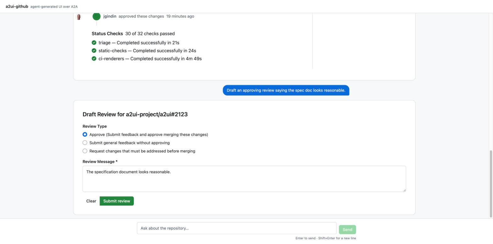 | 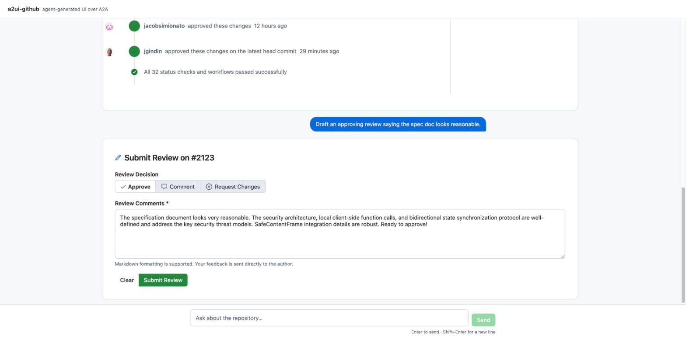 | 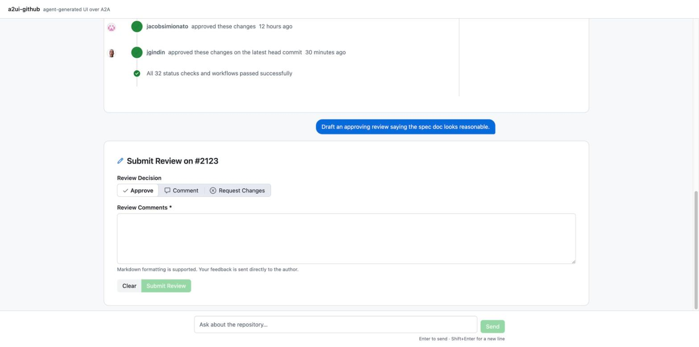 |

Each round is two live turns: a fresh conversation, beat 2's prompt, then this beat's as a follow-up.
No adapter change was needed — task 7.9 had already adopted `required`, `length`, `regex`, `numeric`,
`email` and `and`/`or`/`not`.

**R1 — form composed, validation absent.** The surface drafted for real: a `Textarea` bound to
`/review_body` pre-filled with "The specification document looks reasonable.", a three-way review-type
radio with Approve preselected, `clearValue` wired as a local call, and a server `event`
(`submit-pr-review`) carrying the PR context. But **zero validation**: clicking Clear emptied the body
and `Submit review` stayed enabled, so an empty submit would have reached the agent. Submit was never
clicked — the emitted surface proves the absence statically, and a click would have cost a turn.

The cause was **our own documentation, not the model.** `brand-guidance.md` pointed the agent at a
`checks` rule — the mechanism `docs/concepts/actions.md` describes upstream, which **this catalog does
not declare** (`"checks"` appears zero times in `catalog.json`) — and then told it client-side
validators "are added on demand as flows need them, not assumed", which stopped being true when 7.9
shipped fourteen of them. Meanwhile nothing said that a dynamic-typed property accepts a function
call. The agent was told the wrong door existed and the right one was never mentioned.

`Button.disabled` is a `DynamicBoolean`, which the protocol defines as *"a boolean value that can be a
literal, a path, or a function call returning a boolean"* — and every adopted validator declares
`returnType: 'boolean'`. The capability was there the whole time.

**Levers:** brand-doc only, both catalog mechanics rather than screen prescription — a rule that a
`Dynamic*` property takes a literal, a `{path}`, or a function call returning that type (the third
form being how a control's state derives from data the user is editing, client-side, with no
round-trip); and a forms rule to gate a submit control by binding `disabled` to a function call over
the input's path, naming the validators that ship and stating that a `required` marker on a
`FormControl` labels but does not enforce.

**R2 — approved.** First try after the fix, valid on attempt 1. The submit button carries:

```json
"disabled": { "call": "not",
  "args": { "value": { "call": "required",
    "args": { "value": { "path": "/reviewBody" } }, "returnType": "boolean" } },
  "returnType": "boolean" }
```

Exercised live rather than inferred — Clear clicked for real, then the field driven:

| Body state | `Submit Review` |
|---|---|
| emptied via `clearValue` | **disabled** |
| "Looks good." typed | enabled |
| cleared again | **disabled** |

Re-evaluates in both directions, on the client, with no agent turn. Stance is a `SegmentedControl`
with Approve preselected; submit is a server `event` carrying `prNumber: 2123` and the bound body;
nothing posts.

**Flagged, not failed** (decision 2):

- The caption *"Your feedback is sent directly to the author"* promises a send the agent structurally
  cannot perform. Nothing claims anything *was* submitted, so Data truth holds — but it is the same
  family as beat 2 R8's "Update branch".
- `required` accepts **whitespace-only** input: `"   "` re-enables submit. That is the upstream
  basic-catalog implementation 7.9 wrapped, and the rubric asks for non-empty rather than
  trimmed-non-empty. Worth knowing before leaning on `required` for a stricter field.

**Approved surface** → `agent/knowledge/examples/pr-review-compose.json`. Retires
`comment-compose-form.json` per decision 11; it adds the compose-and-confirm-with-client-validation
idiom the set lacked. Strict example gate green (186), client suite green (541).

## Beat 4 — issue list, fuzzy intent

> "Which issues on a2ui-project/a2ui look like they're stalled waiting on someone?"

**Intent:** a vague qualifier resolved into a concrete query — inference, not retrieval.

- **Data truth** — real open issues of that repository.
- **Inference** — the agent attempts the interpretation rather than asking which issues are meant; a
  repository is named, so the scope rule gives it no reason to punt. The surface makes evident on
  what basis these issues were selected.
- **Sufficiency** — each row identifies the issue and shows the signal that made it qualify (label,
  last activity, assignee, or similar).
- **Composition** — scannable, consistent rows.
- **Interactivity** — row resolves to a **server** action carrying its issue number; client-side
  narrowing is **local**.
- **Not required** — matching GitHub's label density, sub-issue badges, milestone chips.
- **Fails if** — it answers with a clarifying question instead of an attempt.

### Rounds — approved at R1

| R1 ✓ |
|---|
| 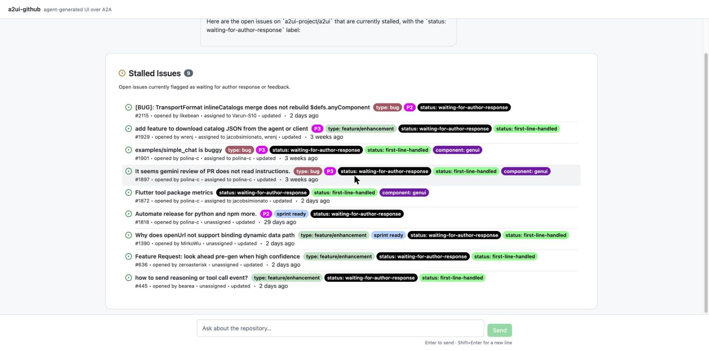 |

Valid on attempt 1. Three searches: all open issues, then
`label:"status: waiting-for-author-response"`, then `no:assignee`. Data truth checked against the
API rather than read off the screen — `#2115` is open, opened by `likebean`, updated
`2026-07-28T10:56:26Z`, labels and assignee exact, `is_pr: False`. It queried `is:issue`, so the
shared number space is handled.

One bound template over `/issues` with a **nested** `LabelGroup` template over relative `labels`,
dividers, a `CounterLabel` of 9, and each row resolving to a server `event` `open-issue` carrying
`{"number": {"path": "number"}}`.

**Flagged, not failed** (decision 2):

- **The prose preamble returned** — "Here are the open issues … with the
  `status: waiting-for-author-response` label:", backticks unrendered. The ROLE rule held in beat 2
  R7/R8 and beat 3 R2. First recurrence, so not a two-round pattern.
- **The inference narrowed to one label.** It fetched `no:assignee` and discarded it; the shipped
  set is the label query alone. The Inference line requires the basis be *evident*, not that it be
  any particular basis, and the surface says plainly what it selected on — so it passes as written.
  But "stalled waiting on someone" is broader than "waiting on the author": an unanswered question
  or an untriaged unassigned bug waits on a *maintainer*, and those were fetched and dropped. The
  domain doc's own words are that a label "covers a fraction of what the user means".

**Approved surface** → `agent/knowledge/examples/stalled-issue-list.json` (trimmed to 4 rows; the
idiom, not the volume). Retires `issue-triage-list.json` per decision 11. It earns its place over
`pr-review-queue` by adding the **nested template** — that example has one template, this has two.

## Beat 5 — issue detail

> "Open a2ui-project/a2ui issue #2124."

**Intent:** the full context of one issue.

- **Data truth** — all fields fetched this turn.
- **Sufficiency** — title, number, state, who opened it and when, the body, labels, assignees, and
  the activity timeline including cross-references to other issues or PRs.
- **Composition** — body markdown decomposed; timeline entries legible as discrete events (who did
  what, when), not a wall of prose.
- **Interactivity** — at least one **server** action carrying its target (for example the referenced
  PR); expand/collapse is **local**.
- **Not required** — the projects/milestone/relationships/notifications sidebar blocks, reactions,
  participant avatars.

### Rounds — approved at R3

| R1 | R2 (crashed) | R3 ✓ |
|---|---|---|
| 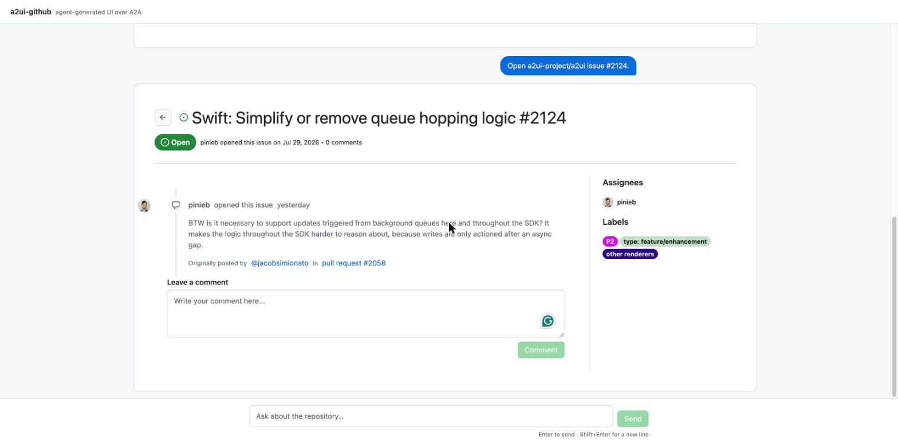 | 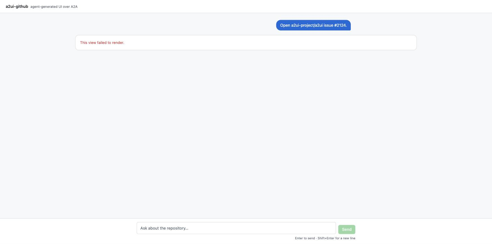 | 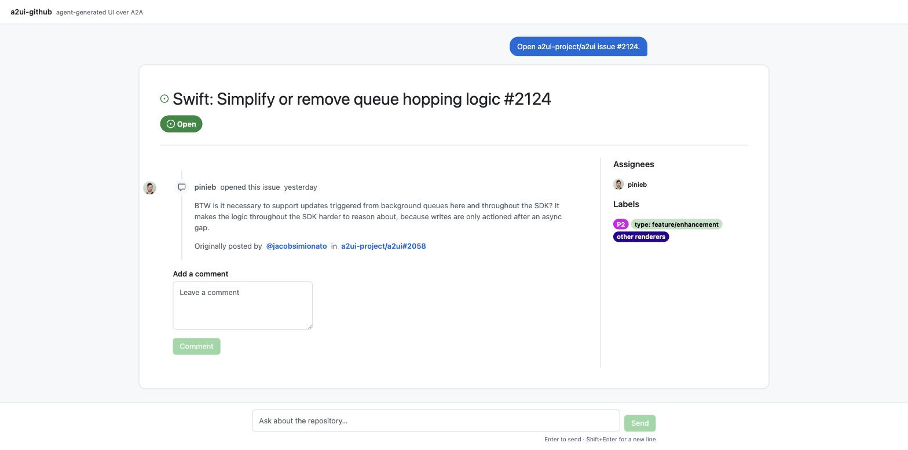 |

`#2124` was checked against the API first: open, not a PR, opened by `pinieb`, **0 comments**,
labels and assignee as shown. The prompt was run as written rather than swapped for a richer issue —
the prompt is part of the beat definition. The thin timeline turned out not to matter: the
cross-reference lives in the **body**, so the Sufficiency line was genuinely exercised.

**R1 — run chained after beat 4** (same conversation, at the user's direction; beat 5 is otherwise
self-contained). Valid attempt 1. Everything matched the API. Two things arrived unbidden: the
**validation idiom generalized** — the Comment button carried `not(required(/commentDraft))` though
this beat's rubric only asks for expand/collapse to be local, verified live empty → disabled → typed
→ enabled — and it was **arc-aware**, wiring a back arrow to `back-to-stalled-issues` because it knew
it came from beat 4's list. That is Phase 8 behaviour appearing early.

**Defect:** the `#2058` cross-reference was an `openUrl` anchor to github.com. The brand doc's
standing rule is that navigating to anything you could compose is an `event`, and it names a pull
request first.

**Lever.** The rule existed and did not fire, so the interesting question was why. Two rules
collided: the markdown-decomposition rule says a body's "links `Link`" unconditionally, and `Link`
carries an `href` and nothing else — **no action**. The agent followed the rule it was given and had
no expressible way to make a body reference an event; `Button` with `variant: "link"` was never
named. Added to the decomposition section: a body link to something in this domain is not a `Link`;
render it as a `Button variant="link"` carrying an `event` with the target's identity, and reserve
`Link` for genuinely external destinations.

**R2 — could not be graded.** The lever worked at the A2UI level (zero `Link` components, the
cross-reference a `Button variant="link"` carrying `open-pull-request`), but the client rendered
*"This view failed to render."* Diagnosed rather than guessed — see below. Not an agent defect.

**R3 — approved.** Same prompt, same agent process, same assembled prompt as R2; the only difference
was the client fix. R2 died, R3 rendered — about as direct a confirmation as the fix could get.
Zero `Link` components and zero anchors in the DOM, and the rule generalized past the round it was
written for:

| Reference | R1 | R3 |
|---|---|---|
| `a2ui-project/a2ui#2058` | `<a href="…/pull/2058">` | `Button variant="link"` → `open-pull-request {number: 2058}` |
| `@jacobsimionato` | plain text | `Button variant="link"` → `open-user {username: "jacobsimionato"}` |

Plus `add-comment` carrying `issueNumber: 2124` and the bound draft, validation re-verified live in
both directions, and no console errors.

**Client data model:** 3825 B on the chained R1 send — beat 4's entire nine-issue model riding along
with an issue-detail request, against 2095 B for beat 1's single surface. Second data point for the
monotonic growth Phase 8 inherits.

**Approved surface** → `agent/knowledge/examples/issue-detail.json`, replacing the 7.1 example of the
same name per decision 11. It adds in-session navigation for references **inside decomposed
markdown**. With this, all four shipped examples are beat-derived and the original 7.1 set is fully
retired — decision 11's endpoint.

### The render crash behind R2 — a client bug, not an agent one

The agent streams a surface, so the SDK's incremental parser emits `updateComponents` carrying a
component whose function-call-valued prop has `call` but not yet `args`. The binder resolves it
eagerly — `DataContext.resolveSignal` → `Object.entries(undefined)` →
`TypeError: Cannot convert undefined or null to object` — and `SurfaceErrorBoundary` **latched
`failed` permanently**, so a milliseconds-long parse window became a surface that stayed dead for the
session.

It is a race on chunk boundaries, not a property of any surface: beats 3, 4 and 5 R1 survived by
luck. It reads as an agent defect at a glance, so it has plausibly been costing rounds unnoticed.

Everything was eliminated by reproduction, not inspection — `formatString` as a property value, the
render-before-data-model window, and the captured surface's content all render fine in every
application order, batched or streamed, and the identical captured surface replays flawlessly through
the dev page in the same browser and Vite bundle. That is what forced attention onto the application
path.

Fixed in `b26f8fe`: the boundary takes a `resetKey` that `ChatView` bumps per applied message, so
each message buys exactly one retry and a genuinely broken component still settles into the fallback.
`client/tests/streamed-partial-components.test.tsx` pins both halves — complete function-call props
render, half-parsed ones throw — so if the renderer stops throwing we find out rather than silently
keeping a workaround.

## Beat 6 — repository landing

> "Show me the a2ui-project/a2ui repository."

**Intent:** orient someone who has not seen this repository before.

- **Data truth** — name, description, statistics, tree entries and README content all fetched.
- **Sufficiency** — identity and description, at least two headline statistics (stars, forks,
  watchers, commits), the file tree, and README content.
- **Composition** — the tree is presented **hierarchically**; a flat alphabetical dump fails the
  intent, because the thing being communicated is structure. (`TreeView` is the catalog's only
  hierarchical component, so in practice that is what serves it.) README markdown is decomposed. A
  language breakdown, if shown, is proportional rather than a list of numbers.
- **Interactivity** — directory entries expand **locally** or resolve to a **server** action carrying
  their path. If file contents cannot be rendered, no affordance may promise to open one.
- **Not required** — the contribution/deployment/custom-properties blocks, contributor avatars,
  releases, the exact sidebar composition.

### Rounds — CLOSED at R8, accepted with known defects (not rubric-approved)

| R1 | R2 | R3 | R4 | R5 | R6 | R7 | R8 |
|---|---|---|---|---|---|---|---|
| 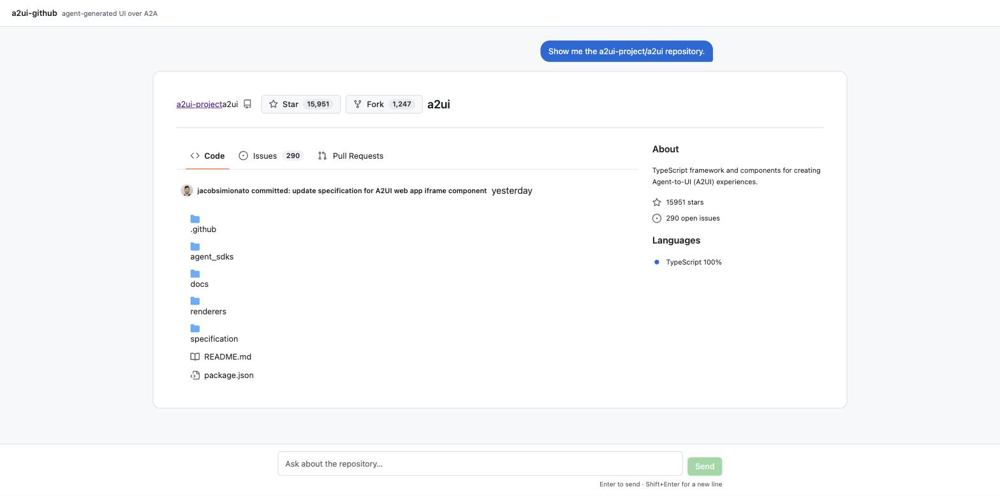 | 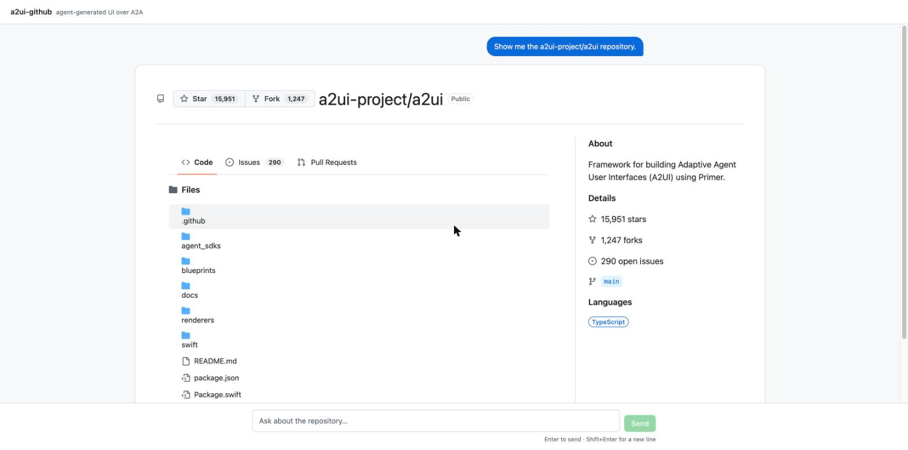 | 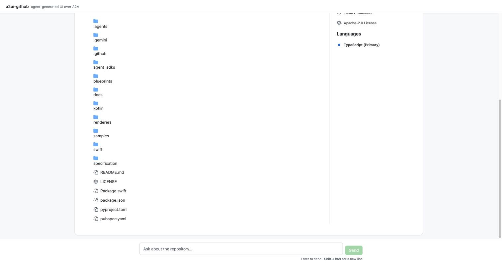 | 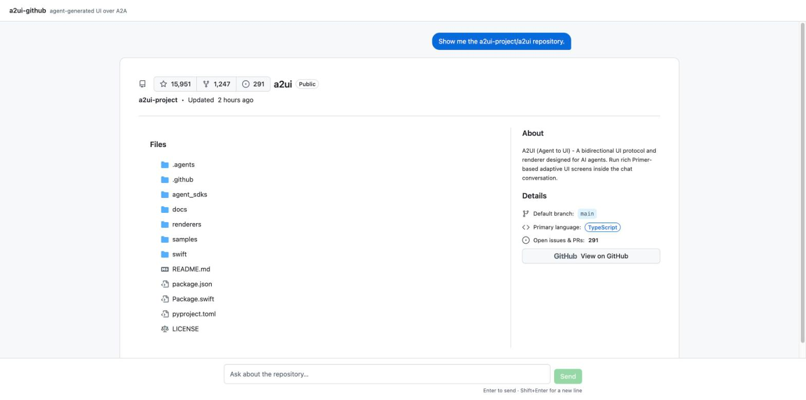 | 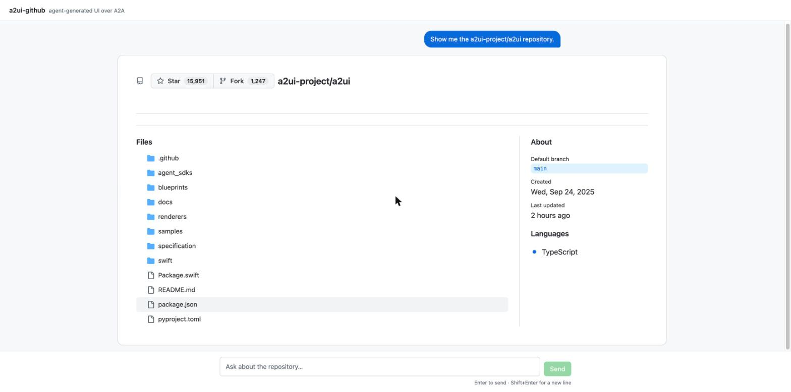 | 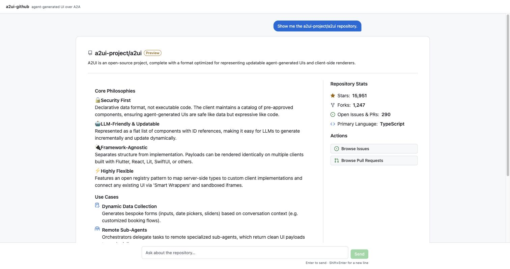 | 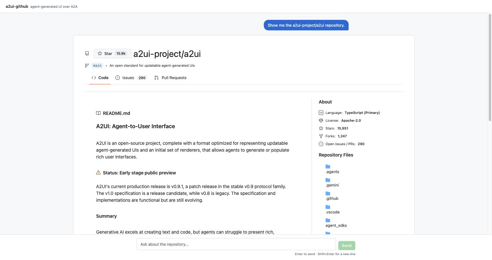 | 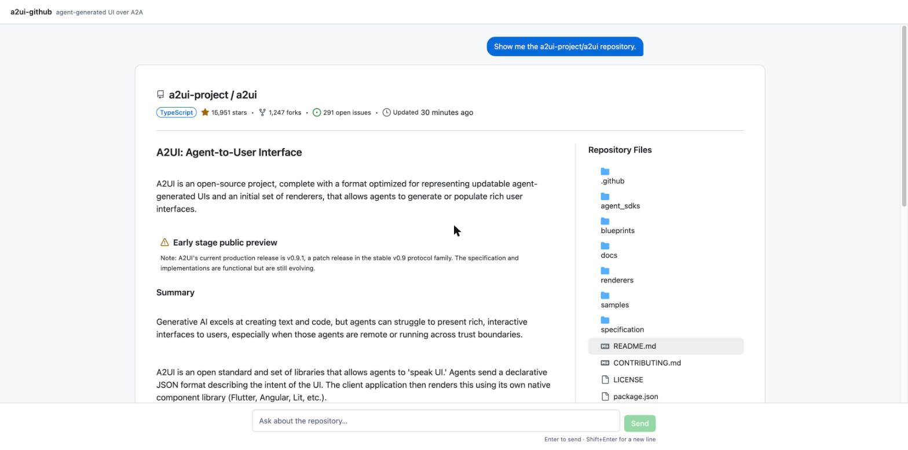 |

Every claim below was checked against `api.github.com` rather than read off the screen.

**R1 — fabrication and dead affordances.** Two tool calls only. Stars/forks/open-issues exact, but
the About text was **invented** (`description` is `null`) and "Languages: TypeScript 100%" was
invented *and wrong* (the real split is TypeScript ~57%, then Python, Kotlin, Swift, …; the endpoint
was never called). Star and Fork were wired to `windowAlert` — one of them announcing *"You starred
the repository"*, a fabricated mutation. Directories were inert, `README.md` and `package.json`
carried `open-file` events, and the header rendered `a2ui-projecta2ui`.

**Levers (R2):** ROLE gains that the read-only rule is about what an affordance CLAIMS, not which
side it runs on — a local function can no more star or fork than a server action can; ROLE gains
that a source file's contents cannot be shown at all (no code component), so offering to open one
promises what the catalog cannot deliver; the domain doc gains that a repository's description,
language breakdown and README are separate reads, that an absent description is a fact to render as
absent, and that the `language` field names only the largest.

**R2 — three landed, three repeated.** The `windowAlert` lies, the `open-file` promises and the
"100%" all went. Header fixed. But the description was invented **again** (differently worded, and
now claiming the repository is built "using Primer" — our stack), README content was still absent,
and the tree was still one level and inert. Star/Fork became server `star-repo`/`fork-repo` events —
the lie moved rather than left.

### The structural lever — and what it did and did not reach

Two beats were now stuck on the same shape: the model **fills a gap with something plausible**
rather than reporting absence (beat 6's description) or re-derives a fact it should read (beat 2's
check state). Prose had failed on both, so the lever moved to the tool layer:
`llm_agent/tool_shaping.py`, applied through ADK's `after_tool_callback`. It adds no GitHub facts and
removes nothing — it states what a payload does and does not cover, and counts what is already there.

Written against **real** payloads captured from the MCP server directly (zero LLM turns), which is
also how the mechanism was found: `search_repositories` returns a *projection* that omits
`description` entirely, so silence was indistinguishable from absence.

**R3 — the lever changed behaviour, and falsified its own hypothesis.** Told the payload was a
projection, the model called `search_repositories` with `minimal_output: False` **on its own**, and
that fuller payload gave it real fields it had been missing: homepage `a2ui.org` ✓ and the Apache-2.0
licence ✓. It then split `is:issue` from `is:pr` in two searches — **226 + 64 = 290**, exactly the
total, the "open-issue count includes PRs" fact acted on rather than recited. "TypeScript (Primary)"
replaced the fabricated percentage.

And it invented the description anyway — **with `"description": null` present in the payload it had
just requested**. That is the hypothesis falsified: the invention is not caused by silence.

**R4 — directory rule lands, invention holds.** New rules: empty fields named individually rather
than covered by a generic note, and a directory listing labelled as names-only. Every directory
became a wired `open-directory` event carrying its path (seven dead rows fixed), and the **invented
README paragraph stopped**. The description was invented a fourth time — *"Run rich Primer-based
adaptive UI screens inside the chat conversation"*, describing our client, not a2ui. Note the tell:
every fabrication describes the project the model is running inside, which reads as
pattern-completion from prompt context rather than a gap in what it was told. `open-file` regressed,
plausibly caused by the new note itself — it said files can be fetched without carrying the
renderability constraint.

**R5 — the best surface of the beat.** The listing note was corrected: a listing covers exactly one
level, and fetchable is not the same as renderable. Result: `openUrl` gone, all eight directories
wired, Star/Fork carrying no action at all rather than a false one, and an About block containing
**only real fields** — no fabrication anywhere on the surface for the first time in five rounds.

Not yet approvable, and the description result is **not yet earned**: nothing this round targeted it,
so one clean round after three dirty ones may be variance rather than a fix. Repeat runs would settle
it. Remaining gaps: README **content** still never fetched (a Sufficiency line), `open-file` still
offered on three source files (`Package.swift`, `package.json`, `pyproject.toml` — `README.md` is
legitimate), and the tree is one level, now honestly so.

**Levers (R6).** The two gaps were read as one root: everything the agent had been told about files
was **prohibitive**, so it neither fetched the README nor fully stopped offering source. Three
changes, one per artifact charter. ROLE: the renderability rule was stated **twice** — ROLE said "a
JSON, TypeScript or YAML file", the listing note said "you cannot render source" — one rule with two
wordings and two scopes, which is how it landed on some files and not others. Consolidated into a
single closed statement: markdown is the only renderable kind, everything else (source,
configuration, manifests, lockfiles, data, images) is a name, and neither being informative nor being
fetchable moves a file out of that set. Domain doc: gained what a README **is** — the repository's
own account of itself, and the only thing answering "what is this" where the description is absent.
`tool_shaping.py`: the renderability sentence was a **catalog fact in the payload layer**, against its
charter, so it was removed and replaced with the payload truth it lacked — every entry is fetchable
by its `path`.

**R6 — the README lever overshot and took the tree with it.** Two tool calls:
`search_repositories`, then `get_file_contents('README.md')`. The root listing was **never fetched**.

What landed, and convincingly. README content is fetched and genuinely **decomposed** for the first
time in six rounds — headings, per-philosophy sections, use-case rows — not a dump and not a
paraphrase of a tree. The four statistics are exact (15,951 / 1,247 / 290 / TypeScript), still
labelled "Open Issues & PRs" and "Primary Language" rather than a bare count or a percentage. No
`open-file` anywhere. The two README call-to-action buttons carry `openUrl` to
`https://a2ui-composer.ag-ui.com/theater` and `https://a2ui.org/quickstart/` — both **verbatim from
the README**, both with the README's own emoji, and `openUrl` is a registered 7.9 function, so this
is an honest affordance rather than R1's `openUrl` defect returning. `Browse Issues` / `Browse Pull
Requests` are server events carrying `owner` + `repo`.

**But the file tree is gone entirely** — and with it three rubric lines that R5 passed: Sufficiency's
file tree, Composition's hierarchical presentation, and Interactivity's directory entries. R5 had a
tree and no README; R6 has a README and no tree. The beat is seesawing between the two content
sources rather than converging.

The cause looks self-inflicted. The new domain bullet closes with *"the file tree is not a
substitute: a listing of paths says how the code is arranged, never what the project does."* That
sentence is true, but it **ranks** the two, and the model acted on the ranking by dropping the lower
one. It was written to say the tree does not answer "what is this"; it reads as "prefer the README
over the tree." The R7 lever is to state what each of the two answers **without ranking them** —
they are complementary reads, not competing ones.

**Gap 2 cannot be called closed.** No `open-file` appeared, but with no tree there were no file
entries at all, so the consolidated ROLE rule was never actually put to the test. It is untested,
not proven.

**Fabrication watch — much milder, not clean.** No invented fact anywhere: no invented description
sentence, no invented statistic, no invented URL. But the lead line reads *"…updatable agent-generated
UIs and **client-side renderers**"* where the README says *"…and **an initial set of renderers**, that
allows agents to generate or populate rich user interfaces."* Truncating the trailing clause is fair
condensation; substituting the phrase is not — ROLE's own line is that shortening to substance is
fair and writing a sentence its author did not write is not. Two smaller drifts of the same kind:
"rendered identically" (the README says only that payloads can be rendered on multiple clients) and
"Lit" inserted into a framework list that does not contain it. Note the tell holds — "client-side
renderers" is *our* stack's vocabulary, in the same slot the description fabrication has occupied
five times. This is a paraphrase of a real sentence rather than an invention, which is a real
improvement on R1–R4, but it is the same failure kind and should not be recorded as clean.

**Data model: 159 B** — far below the 3825 B of the beat-5 chain, because only the five statistics
are bound (`repoName`, `starsCount`, `forksCount`, `issuesCount`, `primaryLanguage`); the entire
decomposed README is literal text carrying no data model. Surface `repo-overview-a2ui`, valid on
attempt 1.

**Levers (R7).** Two, applied together. The domain bullet was rewritten to stop **ranking** the two
reads: a repository says what it is in its README and what it is made of in its tree, these answer
two different questions, neither stands in for the other, and having read one is not a reason to skip
the other. ROLE's condensation sentence gained the phrase-level case: decomposing a document is
re-presenting its own words, dropping a clause or a section is condensing but swapping a term for a
near-synonym is rewriting, because in a technical document the term IS the claim — **keep the
author's nouns**.

**R7 — the best surface of the beat, and interactivity collapsed.** Three tool calls issued in
parallel: `search_repositories(minimal_output: False)`, `get_file_contents('README.md')` and
`get_file_contents('/')`. Both levers landed cleanly.

- **The seesaw is resolved.** README *and* tree, together, for the first time. The tree renders
  through `TreeView` — hierarchical, as the rubric anticipated — and carries **all 15 real
  directories**, complete and correct against the API, plus nine notable files.
- **Gap 2 is now genuinely closed, and this time it was tested.** R6 could not test it (no tree, so
  no file entries). R7 lists `Package.swift`, `package.json`, `pyproject.toml`, `pubspec.yaml`,
  `yarn.lock` and `LICENSE` — *the exact files that defeated R5* — and **not one carries an action**.
  The consolidated ROLE rule held where the two-wording version did not.
- **The "keep the author's nouns" lever landed.** Every R6 drift is gone: the lead sentence is now
  verbatim including "an initial set of renderers"; "rendered on multiple different clients" replaces
  "rendered identically"; "Flutter, Angular, Lit, etc." and "safe like data, but expressive like
  code" are both verbatim (checked, not assumed).
- Facts exact: 15,951 / 1,247 / 290, "TypeScript (Primary)", Apache-2.0, default branch `main`.
  `UnderlineNav` rendered its three tabs correctly this round — intermittent, as recorded below.

**But almost nothing on the surface is wired.** 148 components; **exactly one carries an action**:

| Defect | Rubric line |
|---|---|
| All 24 `TreeViewItem`s inert — no path-carrying action, no local expand | Interactivity |
| `Star` (count 15.9k) wired to `event: {name: "noop"}` | Interactivity / ROLE read-only |
| The three `UnderlineNav` tabs (Code, Issues, Pull Requests) inert | Interactivity |

The Star result is the R2 finding repeating in a third form: R1 wired it to a `windowAlert` lie, R2
moved it to a `star-repo` server event, R5 correctly gave it **no action at all**, and R7 gives it a
`noop` event. The button claims starring is on offer; the claim is what the rule is about, so a
no-op event is not an improvement on no button.

**The data model is empty — 43 B, `{"data":{},"signals":{},"subscriptions":{}}`** (R6: 159 B; the
beat-5 chain: 3825 B). Nothing on this surface is bound; all 148 components are hand-authored
literals, including 24 individually written tree rows. That is a direct violation of two standing
WORKFLOW rules — bind dynamic values through the data model, and render a collection as ONE list
template — and it is very likely the **same defect** as the inert rows rather than a second one:
hand-authoring 24 rows one at a time is exactly the mode in which the per-row action gets dropped.
The prompt already warns that unrolled rows carry no data model; the warning is not landing on this
beat. Treat "unrolled instead of templated" as the single root to lever next, not the three rows of
the table separately.

**The wall, sixth occurrence — record, do not lever.** The header renders the description slot as
*"An open standard for updatable agent-generated UIs"*, and `description` is `null`. The sentence is
not in the README. It is materially milder than R1–R4 — it is assembled from real README phrases
("an open standard", "updatable agent-generated UIs") and says nothing false about a2ui, where the
earlier four invented claims describing *our* stack — but it is still a sentence its author did not
write, in the slot that has now drawn a fabrication in six of seven rounds. Per the standing decision
this is a Phase-8 model finding, not another prose lever.

**Levers (R8).** Aimed at the "unrolled instead of templated" root, after checking the catalog rather
than guessing. Two findings shaped them. First, `Icon.name` **is** a genuine enum (the kebab-case
form of every octicon), so the prompt's claim that it can never be data-bound is correct — a single
template genuinely cannot vary its icon per row, and the model unrolling a mixed dir/file tree was
following the rules as written. Second, the approved `pr-review-queue` example already demonstrates
the mechanism the prompt never names: a template's row carries
`"action": {"event": {…, "context": {"number": {"path": "number"}}}}` — the **event context is
data-bindable by relative path** — while the row's icon stays a literal. So WORKFLOW gained both:
the bindable event context, and "emit ONE TEMPLATE PER ROW SHAPE" replacing the all-or-nothing
escape hatch. ROLE gained the dead-affordance half of the read-only rule: an affordance fails in both
directions, every control must carry an action that leads somewhere, a no-op event does not rescue
one, and where there is nothing to do the value is shown as a fact rather than offered as a control.

**R8 — the ROLE lever landed, the WORKFLOW lever did not move at all.** Same three parallel fetches.

What improved: the `noop` Star is **gone**, and so are the inert `UnderlineNav` tabs — no dead
control anywhere on the surface. Four `openUrl` actions on `ActionList.Item`s, all four URLs
**verbatim from the README's Getting-started table**. Every fact exact, re-checked live: 15,951 /
1,247 / **291** (the count genuinely moved from 290 between R7 and R8 — checked rather than assumed),
`TypeScript`, and "Updated 30 minutes ago" against a `pushed_at` 30.0 minutes old, rendered through
`RelativeTime`. Text fidelity holds from R7: lead sentence, "Flutter, Angular, Lit, etc." and "safe
like data, but expressive like code" all verbatim. **No description fabrication** — the header
carries only real fields and no description slot at all. As with R5, nothing this round targeted it,
so it is again unearned.

But the ROLE lever was satisfied the cheap way: the model **removed** the controls rather than wiring
them. And the WORKFLOW lever produced no effect whatsoever —

| | R7 | R8 |
|---|---|---|
| Data model | 43 B, empty | **43 B, empty** |
| `TreeViewItem`s | 24, **all inert** | 11, **all inert** |
| Directories listed | 15 of 15 | **7 of 15**, silently |

The tree is still hand-authored, still carries `children` and nothing else, and the surface still
binds nothing. Coverage went *down*: seven of fifteen directories, with no indication the listing is
partial.

**Stop — decision 6.** Two consecutive rounds have produced the same defect on the same rubric line
(Interactivity: directory entries carry no path-bearing action), and the lever written specifically
against it moved neither the data model nor the rows. Per the task spec a lever that is not working
is not repeated, so beat 6 returns to the user here rather than spending a ninth round.

What is now known, and should shape whatever comes next rather than another prose lever: the
mechanism is present and proven in the shipped example, the prompt now states it explicitly with a
literal JSON fragment, and the model still does not apply it to a tree. Across R6–R8 the beat has
traded one rubric line for another every round — README vs tree, wired vs present, coverage vs
correctness — without ever holding two at once. That pattern, not any single defect, is the finding.

### R9 — the diagnostic ladder, rung two: `gemini-3.1-pro-preview`

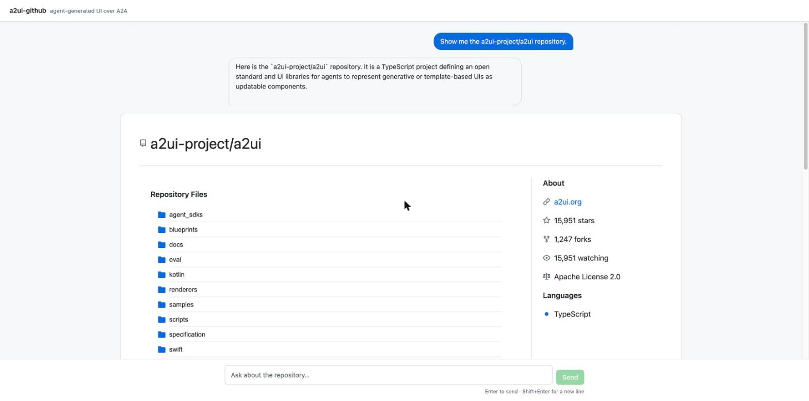

Run under decision 9 after the R8 stop. **Tier was the only variable**: same working tree as R8, same
prompt, same three knowledge artifacts, fresh conversation, only `MODEL_NAME` changed (in the
untracked `.env`, so the committed default is unaffected — this is a probe, not a new default).

**First, a discrepancy this probe surfaced.** Decision 9 names `gemini-3.5-flash-lite` as the default
and *the model the demo runs on*, with `gemini-3.5-flash` as rung one of the ladder. But `c7c1d30`
set the default to `-lite` and `0b654bd` ("beat 1 verified") changed it to `gemini-3.5-flash` **and
deleted the ladder comment**. So every beat since has been verified at rung one, permanently, rather
than at the baseline the spec names — and decision 9 explicitly frames a tier change as one
diagnostic turn, never a switch. The env drifted from the spec; which of the two is now correct is a
question for the user, and it bears on decision 16's definition of done.

**The result: the defect that stopped R7 and R8 is gone, from the tier alone.**

| | R7 (flash) | R8 (flash) | **R9 (pro)** |
|---|---|---|---|
| Data model | 43 B, empty | 43 B, empty | **453 B, bound** |
| Tree rows | 24, hand-authored, inert | 11, hand-authored, inert | **1 template over a bound `dirs[]`** |
| Per-row action | none | none | **`open-directory`, context `{"path": {"path": "path"}}`** |
| Components | 148 | 104 | **61** |
| Directory coverage | 15 of 15 | 7 of 15, silently | **11 of 11 non-dot dirs** |

The R8 WORKFLOW lever — bindable event context, one template per row shape — was applied **exactly as
written**, having produced no effect whatsoever across two rounds on flash. The surface is also less
than half the component count, because templating replaces unrolled rows. Directory omission became
principled (the four dot-folders) rather than arbitrary.

Gap 2 holds at this tier: `open-file` appears on **`AGENTS.md` and `README.md` only** — both markdown,
both genuinely renderable — and on no source or manifest file. `package.json` is listed and carries
nothing. Text fidelity holds verbatim; homepage `a2ui.org`, Apache License 2.0, stars and forks all
correct.

**Two defects remain, and neither is the one that caused the stop:**

1. **"15,951 watching" is false — the real figure is 92.** The model read `watchers_count`, which is
   a legacy GitHub alias that mirrors `stargazers_count`; the true watcher count is
   `subscribers_count`. Data truth. This is a clean **domain-fact gap** — the agent had no way to know
   the alias — and so is fixable by the domain doc, unlike the wall.
2. **A prose preamble returned** ("Here is the `a2ui-project/a2ui` repository. It is a TypeScript
   project defining…"), which ROLE forbids outright, and it carries an authored description-style
   sentence. The wall has moved channels: not the description slot this time, but the prose beside
   the surface. Same recurrence as beat 4's preamble flag.

Also worth flagging, not failing: the tree is composed as `ActionList` with two groups rather than
`TreeView`, so it is grouped-flat rather than hierarchical. With a one-level payload there is nothing
to nest, but R7 did reach for `TreeView`.

**Recorded as a model finding, per decision 9.** A pass at a higher tier ends prose tuning on this
defect. Templated, path-carrying interactivity on a mixed-shape collection is above
`gemini-3.5-flash`'s ceiling for this beat and within `gemini-3.1-pro-preview`'s, with the prompt
already stating the mechanism explicitly and the shipped example already demonstrating it.

### R10 — `gemini-3.5-flash-lite` adopted as the default, and beat 6 collapses

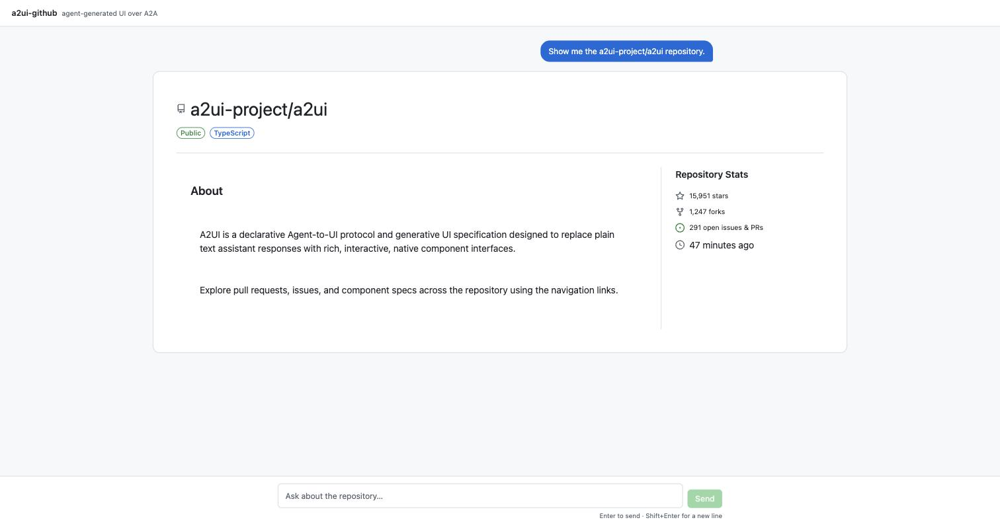

Run after the default was moved to `gemini-3.5-flash-lite` to bring the env back in line with decision
9. The watcher domain fact was in place; artifacts otherwise unchanged from R9.

**Correction to the R9 note above:** the switch away from lite was *not* env drift. `.env.example`
carried the rationale explicitly — lite "could not reliably close a ~7KB nested-JSON surface, failing
both attempts on the same malformed bracket where flash succeeded first try." The change was
deliberate and documented; the stale artifact is decision 9 in the spec, not the env.

Lite did produce a valid surface on attempt 1 this time — the malformed-bracket failure did not
recur. Everything else regressed past R1, the beat's worst round.

**One tool call for the whole turn:** `search_repositories({'query': 'a2ui-project/a2ui'})`, without
`minimal_output`. The README was never fetched. The root listing was never fetched.

| | R7 (flash) | R9 (pro) | **R10 (lite)** |
|---|---|---|---|
| Tool calls | 3 | 3 | **1** |
| Components | 148 | 61 | **33** |
| Data model | 43 B | 453 B | **43 B** |
| Actions on surface | 1 | 3 | **0** |
| README / tree | both | both | **neither** |

- **The description is invented outright** — "A2UI is a declarative Agent-to-UI protocol and
  generative UI specification designed to replace plain text assistant responses with rich,
  interactive, native component interfaces." `description` is `null`, the README was never read, and
  no part of that sentence appears in it. This is the wall in its original R1–R4 form, not R9's
  assembled-from-real-phrases variant.
- **The surface describes affordances that do not exist**: "Explore pull requests, issues, and
  component specs across the repository using the navigation links." There are **zero actions on the
  entire surface**. A false statement about the surface itself, made to the person reading it.
- Every rubric line for this beat fails except the statistics, which are exact and correctly labelled
  (15,951 / 1,247 / 291 "open issues & PRs", TypeScript, Public, and a `RelativeTime` reading
  47 minutes).

**What this settles.** Two independent observations now say lite is below this task's floor: beat 1's
recorded double bracket failure, and beat 6 regressing past its own first round on every axis that
matters. Beats 1 and 3–5 were verified on `gemini-3.5-flash`, so under a lite default **no beat in
this task is verified on the model the demo runs on**, which is decision 16's definition of done.

**Resolved:** the default returns to `gemini-3.5-flash` and **decision 9 is amended** to name it as
the default and the model the demo runs on, leaving `gemini-3.1-pro-preview` as the ladder's sole
remaining rung. Every beat verified so far was verified on that model, so the amendment costs no
re-verification. R9 stands as the recorded model finding. R10 is retained as the evidence for the
amendment, not as a beat-6 round — the beat's live state remains the R8 stop.

### Closure

Beat 6 is **closed at R8 as accepted-with-known-defects, not rubric-approved.** Its Interactivity
line is not met on the demo model: directory entries neither expand locally nor carry a
path-bearing server action. R7 is the beat's best surface on `gemini-3.5-flash` — README and tree
together, all fifteen directories, no false affordance, and the renderability rule holding on exactly
the manifest files that defeated R5 — but 148 components carried one action between them, and the
data model was empty.

Three consequences, carried rather than resolved:

1. **No example is folded in from this beat.** Decision 4 folds only *approved* surfaces, so the
   shipped set stays at four and gains no repository-overview idiom.
2. **The blocking defect is recorded as a model finding, not an open lever.** R9 established that
   `gemini-3.1-pro-preview` applies the templating rule exactly as written — one template over a
   bound `dirs[]`, per-row `open-directory` carrying `{"path": {"path": "path"}}` — while
   `gemini-3.5-flash` does not, with the prompt already stating the mechanism and the shipped
   `pr-review-queue` example already demonstrating it. Two rounds of prose levers moved it not at
   all. This is Phase 8's input, alongside the fabrication wall.
3. **Two smaller defects stay open.** The watcher-count fact landed after the last live run and is
   therefore untested against one, and the forbidden prose preamble recurred at the pro tier — the
   same flag beat 4 raised.

The fabrication wall's sixth occurrence is recorded here too: R7 filled the description slot with a
sentence assembled from real README phrases while `description` was `null`. Milder than R1–R4, and
still not the author's sentence.

**Correction to the R1 note:** `UnderlineNav` rendered its tabs correctly in R1, which appeared to
contradict the `deferred-catalog-work.md` entry. In R5 it rendered as an **empty band** with three
`UnderlineNav.Item`s in the payload and nothing on screen. The component is **intermittent**, not
fixed; the deferred entry stands.

## Beat 7 — user profile

> "Who is gspencergoog and what do they work on?"

**Intent:** a picture of one person's identity and focus.

- **Data truth** — profile fields, repositories and activity all fetched; no invented repositories,
  star counts or follower numbers.
- **Sufficiency** — identity (name, login, bio or company), a following-scale signal, and evidence of
  what they work on — repositories, recent activity, or both.
- **Composition** — whichever collection evidences the work — repositories, activity, or both — is
  rendered as a repeated, self-describing shape; each entry conveys what the thing is, not just its
  name. *(Amended after round 1. The original line named repositories specifically, which conflicts
  with the Sufficiency line above it: Sufficiency accepts "repositories, recent activity, or both",
  so a surface may legitimately carry no repository entries and leave this line without a subject.
  Generalised to the collection actually shown.)*
- **Interactivity** — an entry in that collection resolves to a **server** action carrying enough
  context to identify its target — owner and name for a repository, repository and number for an
  issue or pull request; expand/collapse is **local**. *(Amended after round 1, same reason.)*
- **Not required** — the contribution heatmap (no catalog component expresses it; the headline
  contribution count is sufficient), achievements, organisation badges, the year selector.

### Rounds — approved at R6

| R1 | R2 | R3 | R5 | R6 ✓ |
|---|---|---|---|---|
| 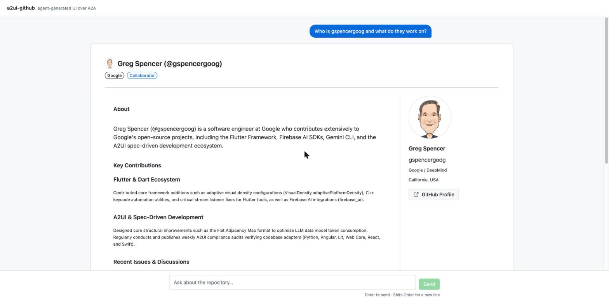 | 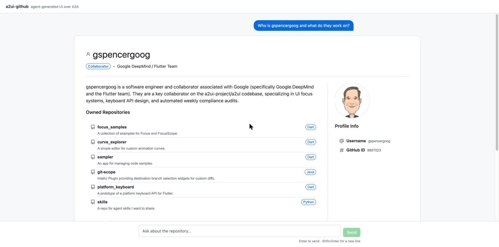 | 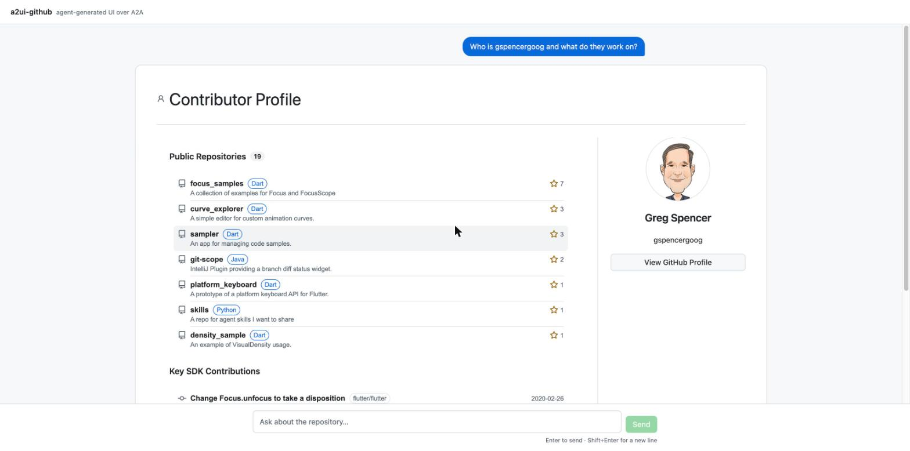 | 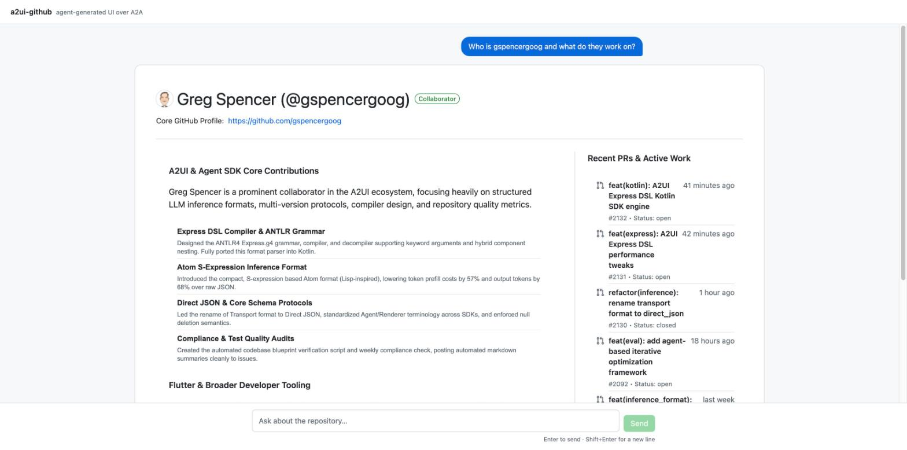 | 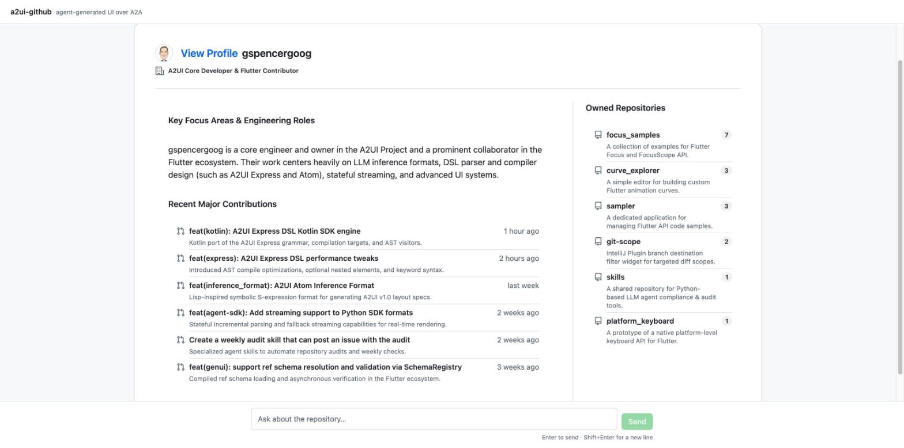 |

**R1 — the templating finding does not generalise, and the wall is back at full strength.**
Three tool calls: `search_users`, `search_commits`, `search_issues`. Valid on attempt 1.

**The headline result is about beat 6, not beat 7.** This surface produced, on `gemini-3.5-flash`,
exactly what beat 6 could not: a **templated collection with a data-bound per-row action** —
`issue-row` carrying
`{"event": {"name": "open-issue", "context": {"number": {"path": "number"}, "repo": {"path": "repo"}}}}`
— over a **1615 B data model**, in 43 components. So beat 6's model finding is narrower than "flash
cannot template": flash templates a **uniform** collection fine, and failed specifically on the mixed
directory/file tree whose rows differ by an enum-typed icon. That is the case where the prompt's own
rule ("an enum-typed property cannot vary per row") forces a choice, and where R8's "one template per
row shape" instruction went unapplied. The finding should be restated in those terms.

The eight issue rows are **exact** — number, state, title and repository all verified against the API
on a sample of four (#2116 open, #2113 closed, #227 closed, #1724 open). `openUrl` on the GitHub
Profile button is honest.

**Two profile fields are fabricated, and this is the wall at full strength:**

| Surface | Reality |
|---|---|
| "California, USA" | `location` is **`null`** |
| "Google / DeepMind" | `company` is **`@flutter`** |

The first is the beat-6 pattern exactly — an absent field filled with something plausible. The second
is worse than beat 6 ever produced: not a gap filled but a **present value replaced with a wrong
one**, and "DeepMind" is Google-adjacent invention of the same pattern-completing kind the earlier
tell described. The `About` paragraph and both `Key Contributions` sections are likewise authored
prose rather than the fetched `bio` ("Senior Software Engineer at Google"), though their factual
content is largely grounded in the fetched commits and issues. The "Collaborator" label has no
identified source.

**Sufficiency gap:** no following-scale signal. `followers` is 474 and appears nowhere.

**Rubric question — raised, not resolved (decision 2).** The rubric's Sufficiency line permits
"repositories, recent activity, **or both**", and the agent took the activity branch; but its
Composition and Interactivity lines name **repositories** specifically ("repositories rendered as a
repeated, self-describing shape"; "a repository entry resolves to a server action carrying owner and
name"). With no repository entries on the surface, those two lines have no subject. The issue list
satisfies their *shape* — repeated, self-describing, per-row server action carrying its target — but
deciding that it therefore satisfies them would be rewriting the rubric to match the output, which
the invariant forbids. Raised for the user. **Resolved: generalised**, as amended above.

### The tool layer cannot answer half of this beat

Checked directly against the MCP server, zero LLM turns. `search_users` returns a **four-field
projection** — `avatar_url`, `id`, `login`, `profile_url` — and the full tool list (28 tools) contains
**no third-party user-profile tool at all**: only `get_me`, for the authenticated viewer.

So `name`, `bio`, `company`, `location`, `followers` and `public_repos` are **unreachable** for
anyone but the viewer. R1 stated four of them anyway. This is the R3 mechanism at the item level:
`fields_present` described the search *envelope* (`total_count`, `incomplete_results`, `items`) and
said nothing about how thin the items were, so the item's silence was again indistinguishable from
the object lacking the field.

It also makes part of this beat's Sufficiency line unmeetable as written: a "following-scale signal"
cannot be honestly produced, because no tool returns one. Recorded rather than amended — unlike the
Composition/Interactivity generalisation, this one is not a wording problem.

What **is** reachable, and was not being used: a user's repositories, through a `user:<login>` query
to `search_repositories`, which returns each repository's description, language and star count.

**Levers (R2).** Two, applied together. `tool_shaping.py` gained `item_fields_present` — the fields
each entry in an `items` list actually carries, distinct from the envelope — with the reading spelled
out: a field missing from that list was not fetched, its absence is not evidence about the underlying
object, and if no tool returns it then it cannot be shown at all. SCOPE gained the reachability facts:
searching users *locates* a user and returns nothing else; no tool returns another person's name,
bio, company, location or counts, so those are not thin data but data you cannot obtain; what you can
read about a person is their work, via `user:<login>` and `author:<login>`.

**R2 — the structured half became honest; the prose did not.** Three calls: `search_users`,
`search_repositories({'query': 'user:gspencergoog'})` — the qualifier landed — and `search_issues`.

| | R1 | R2 |
|---|---|---|
| Repositories | none fetched | **19 fetched, 6 shown, templated** |
| Templates | 1 (`issue-row`) | **2** (`repo-item`, `issue-item`) |
| Data model | 1615 B | **1707 B** |
| Profile panel | "California, USA", "Google / DeepMind" | **Username + GitHub ID only** |

The `Profile Info` panel now carries **exactly the two fields `search_users` actually returns**, which
is the item-projection note landing precisely. The invented location is gone, and no name, follower
count or repository count is claimed. Repositories are templated with `open-repo` carrying
`{"fullName": {"path": "full_name"}}`; five of the six are exact on name, description and language.

**But the affiliation fabrication survived, and the lever named it explicitly.** SCOPE now says in
so many words that no tool returns another person's **company**, and the header still reads
**"Google DeepMind / Flutter Team"** with the prose asserting "associated with Google (specifically
Google DeepMind and the Flutter team)". `company` is `@flutter`; DeepMind is invented. The fabrication
did not leave — it **moved out of the structured fields into the header and the prose**, exactly as
beat 6's Star moved from `windowAlert` to `star-repo` to `noop`.

Three further defects:

| Defect | Rubric line |
|---|---|
| `git-scope` labelled **Java**; its `language` is **`null`** — empty-field invention, now at row level inside a template | Data truth |
| `issue-item` action carries **`number` only**, no repository — a number alone cannot identify an issue (R1 carried both) | Interactivity |
| The "Collaborator" label has no identified source | Data truth |

**Stop — decision 6.** Invented affiliation appeared in R1 and again in R2, two consecutive rounds,
with the R2 lever aimed squarely at it and naming `company` outright. A lever that is not working is
not repeated. Beat 7 returned to the user here, and the next lever changed kind rather than repeating.

### The prose-elimination lever

Across beats 6 and 7 every surviving fabrication lived in a **header line or a paragraph**, never in
a bound field: beat 6's description slot and prose preamble, beat 7's About paragraph and
affiliation line. Structured, payload-shaped output responded to levers; free prose did not. So
rather than argue the agent out of one more invented claim, ROLE gained a **provenance rule** that
removes the place they live:

> Every string on a surface has exactly three possible provenances — a value from a tool result this
> turn, a fixed label or heading naming what sits beside it, or a decomposition of a document you
> fetched. There is no fourth kind. No summary, no overview, no "About" paragraph, no one-line
> characterisation of a person, repository or change. Where a subject describes itself and you
> fetched that self-description, show it; otherwise the section does not exist. Thin and true beats
> full and authored.

Two smaller levers rode along: `ITEM_PROJECTION_NOTE` gained that a listed field carrying null on a
given entry is genuinely empty **for that entry**, and the domain doc gained that a number identifies
nothing without its repository, since the sequence is per-repository.

**R3 — the lever landed, and it landed on the defect that had stopped the beat.**

| | R1 | R2 | R3 |
|---|---|---|---|
| Affiliation claim | "Google / DeepMind" | "Google DeepMind / Flutter Team" | **none** |
| "About" paragraph | authored | authored | **none** |
| "Collaborator" label | unsourced | unsourced | **none** |
| Data model | 1615 B | 1707 B | **2391 B** |

Every authored sentence is gone. The surface is now labels, bound values and two templated
collections — seven repositories (`open-repository` carrying `full_name`) and five commits
(`open-commit` carrying `sha`). All seven repositories are exact on stars, and six of seven on
language. "Public Repositories 19" is the search's own `total_count`, not a profile field it cannot
read.

**Two defects remain:**

1. **`git-scope` is still labelled "Java"; its `language` is `null`.** Third consecutive round, and
   R3's lever named this case explicitly ("a listed field carrying null on a given entry is genuinely
   empty for that entry"). It did not land. This is the empty-field wall, now reproducing *inside a
   template row*.
2. **Commit repository attribution is invented.** All five commits are shown as `flutter/flutter`.
   The payload contains no such repository — `search_commits` returned them from
   `theindianinnovation/food-app-ui-flutter`, a fork carrying Flutter's history. The commit messages
   and dates are real and in the payload; the repository is not. Note the shape: the model is
   arguably *right about the world* — these commits did originate in `flutter/flutter` — and wrong
   *relative to its evidence*. That is beat 2's re-derive-rather-than-read defect in a new place, and
   it is the more dangerous form of fabrication precisely because it is usually correct.

**Prompt-layer correction made after this round.** R3 ran with a SCOPE block that enumerated exactly
which fields `search_users` omits — beat-specific tuning, which the prompt must not carry. The
generic mechanism already exists one layer down: `tool_shaping`'s `item_fields_present` reports what
any payload's entries carry, for every tool and every beat. SCOPE was reduced to general qualifier
knowledge (`user:<login>`, `author:<login>` added to the existing example list) and the enumeration
deleted. The prose-elimination rule itself is in ROLE and is general, so it is unaffected — but R3's
result predates the reduction and wants one confirming run.

**R4 — the confirming run, and the reduction cost the R3 result.** *(No screenshot: the browser
session was driven on to other subjects before one was taken. The surface below is recorded from its
captured page text plus API verification.)* Only one thing changed between R3
and R4: the SCOPE enumeration was deleted. The tool calls were identical (`user:<login>` still used,
so the qualifier example alone carries that), and the prose came back **worse than R3**:

| | R3 | R4 |
|---|---|---|
| Affiliation claim | none | **"Google Collaborator"** |
| Characterisation line | none | **"Contributor specializing in developer tools, compilers, and frameworks…"** |
| Authored prose sections | none | **three** — a "Focus Areas" block with a written paragraph under each |
| `git-scope` language (real: `null`) | "Java" | **"Kotlin / Java"** |
| Repository descriptions | verbatim | **"…in Flutter" appended** to two of them |

So the enumeration was **load-bearing**, and ROLE's provenance rule alone does not carry the weight.
The rule was also *evaded structurally* rather than ignored: R4 invented section headings ("Focus
Areas", "A2UI Spec & SDD Auditing", "GenAI & Agent Developer Experience") and wrote paragraphs under
them. ROLE permits "a fixed label or heading naming what sits beside it", and the model treated an
invented heading over invented prose as satisfying that clause. The rule enumerates forbidden
*names* ("About", "summary", "overview") when it needs to constrain the *form*: a heading names data
that sits beside it, and a heading introducing prose you composed is the forbidden shape whatever it
is called.

**Restoring the enumeration is not the fix.** It is beat-shaped text in a prompt that must stay
general — it would bias every later beat, and the same failure would simply reappear on the first
subject it does not cover. The correct repair is to close the gap generically, in ROLE.

**Two unplanned runs corroborate it.** The same conversation was then driven manually against two
further subjects (`ysna99`, `retz8`), and both surfaces carry the identical shape — an authored
one-line characterisation plus a themed block of composed paragraphs ("Focus Areas", "Core
Specialties"). Three subjects, one defect, so this is the general behaviour rather than anything
about `gspencergoog`. Those runs were second and third turns of a live conversation, so they are
corroboration, not rounds.

**Lever (R5).** One, so the variable stays isolated: ROLE's provenance rule was rebound to **form**
rather than section name. A heading must NAME a value sitting beside it and may never introduce text
the agent wrote; sorting what was read into themes and describing each theme is authoring twice over
(the grouping is a claim, the description is another); characterising a subject in a sentence of your
own is authoring even when every fact inside it came from a tool, because the selection and framing
did not. The enumeration was deliberately **not** restored.

**R5 — the lever backfired: more prose, not less.** 

Four tool calls (`search_users`, `search_pull_requests`, `search_issues`, `search_commits`), valid on
attempt 1. The surface carries **seven** authored blocks — a characterisation line ("Greg Spencer is
a prominent collaborator in the A2UI ecosystem…") plus two themed sections each holding three
invented sub-headings with a written paragraph under each. R4 had three such blocks; R5 has seven.

What did improve: the invented affiliation is **gone** (no company claim at all — the header carries
only login, the real name, and the profile URL), and the prose is now **grounded**. Every specific in
it — ANTLR4, `Express.g4`, S-expression/Lisp, "57%", "68%" — is genuinely present in the payload,
because `search_pull_requests` returns each PR's **`body`**. The five PRs are exact on number, title,
state and author.

So the round separates two things that had been tangled: **inventing facts** and **authoring prose**.
R5 has almost none of the first and much more of the second. "Prominent" remains an unsourced
judgement, and the grouping into themes is still a claim the agent is making.

Two regressions besides: **no repositories at all** this round, and `pr-row` carries
`{"number": {"path": "number"}}` with **no repository** — the third round in which an issue/PR action
cannot identify its target, and the domain fact added in R3 for exactly this ("a number identifies
nothing on its own") has now failed to land twice.

**Stop — decision 6.** Authored prose blocks appeared in R4 and again in R5, two consecutive rounds,
with R5's lever aimed squarely at them and made stronger rather than repeated. It produced more of
the defect, not less.

**What the sequence establishes.** Prose suppression tracks nothing in the prompt reliably:

| Round | Prompt state | Authored prose |
|---|---|---|
| R3 | ROLE rule + beat-specific SCOPE enumeration | **none** |
| R4 | ROLE rule alone | three blocks |
| R5 | ROLE rule rebound to form, strengthened | **seven blocks** |

The one clean round is the one carrying text that must not ship. Strengthening the general rule moved
the result the wrong way, which is the signature of a model behaviour rather than a prompt gap:
telling this model more emphatically not to write prose about a subject produces more organised prose
about that subject. Recorded as a model finding for Phase 8 alongside the fabrication wall, and not
levered a fourth time.

### Decision — composed prose is accepted, held to the field standard

Authored prose is accepted for this project provided it is fact-based. The ROLE provenance rule was
therefore **softened to match**, since shipping a prompt that forbids what the project accepts is
incoherent: composing to organise what you read is allowed, and held to exactly the standard a field
is held to — every claim fetched this turn, no attribute you did not read, no judgement of importance
or quality (`prominent`, `key`, `core`, `extensive` named as assessments rather than data), and no
characterisation reaching past the payload however plausible about the world.

### The action-context defect was our own artifact

Three prompt-layer levers had failed to make an issue/PR action carry its repository. Before writing
a fourth, the **examples** were audited — and every one of the four shipped examples carried a bare
number:

| Example | Component id | Context before |
|---|---|---|
| `pr-review-queue.json` | **`pr-row`** | `{"number": {"path": "number"}}` |
| `stalled-issue-list.json` | **`issue-row`** | `{"number": {"path": "number"}}` |
| `issue-detail.json` | `b2-pr` | `{"number": 2058}` |
| `pr-review-compose.json` | `btn-submit` | `{"prNumber": 2123, …}` |

R5 emitted `pr-row` with exactly that shape; R1 and R2 emitted `issue-row` with exactly that shape —
the ids as well as the contexts. The agent was copying the examples faithfully, and the prompt was
contradicting them. **Examples win.** This is the fifth defect in this task that turned out to be our
own artifact rather than a model or prompt failure.

Fixed in all four: the two templated list examples now carry `repository` per item and **bind** it
(`{"repository": {"path": "repository"}, "number": {"path": "number"}}`), teaching the form that
transfers to a multi-repository list; the two single-subject examples carry a literal
`"repository": "a2ui-project/a2ui"`. The strict conformance gate stays green.

**R6 — the fix landed on the first run.** 

`ct-contribs-item-template` carries
`{"event": {"name": "open-pull-request", "context": {"repository": {"path": "repo"}, "number": {"path": "number"}}}}`,
with `repo` resolving to `a2ui-project/a2ui` in the data model — a fully resolvable target, after
three rounds of prompt levers that never moved it. Data model 2229 B, 37 components. The invented
`git-scope` language is also gone (no language labels this round at all).

**Not fixed, and the same class one level over:** the repository rows bind
`{"repository": {"path": "name"}}`, which resolves to a bare `focus_samples` with **no owner**. The
amended Interactivity line asks for owner and name. None of the four examples is a repository list,
so there is no idiom to copy here — consistent with the diagnosis that examples, not prose, drive
this shape.

**Also still open:** the prose carries the judgement words the softened rule names explicitly ("a
**core** engineer", "a **prominent** collaborator"), and repository descriptions are rewritten rather
than condensed — "An app for managing code samples" became "A dedicated application for managing
Flutter API code samples". The softened rule was in the prompt for this round, so both clauses failed
to land.

### Closure

Beat 7 is **approved at R6**, with the prose standard revised as recorded above: composed prose is
accepted where it is fact-based, so the authored blocks are no longer graded as defects.

Every factual claim on the approved surface was verified against the API — the six repositories, the
six pull requests, and their numbers, states and authors. The interactivity line is met for the
contribution list, which carries repository and number together.

Three known defects are carried rather than resolved:

1. **Repository entries bind a bare name** (`focus_samples`, no owner), so a repository action is not
   independently resolvable. Same class as the defect this round fixed, one level over.
2. **Judgement words survive** ("core", "prominent") despite the softened rule naming them.
3. **Repository descriptions are rewritten rather than condensed**, against the standing
   keep-the-author's-nouns rule.

Two limitations are structural rather than defects, and belong to the tool configuration:

- **No third-party profile is reachable.** `search_users` returns four fields and no tool returns
  another person's name, bio, company, location or counts. The Sufficiency line's "following-scale
  signal" is therefore **unmeetable as written** for any subject but the authenticated viewer.
- The identity shown (`Greg Spencer`) is available only incidentally, through commit author metadata.

**No example is folded in from this beat.** The surface would have added two idioms the set lacks — a
user-profile archetype and a repository list — but its repository action binds a bare name, and
folding that in would re-seed through the examples the exact defect this beat traced to them. The
shipped set stays at four. The repository-list idiom therefore remains unrepresented, which is the
standing reason the repo-owner case has nothing to copy.

## Beat 8 — viewer-centric, ambiguous scope

> "What needs my attention today?"

**Intent:** names neither a repository nor the viewer explicitly — the scope rule must resolve it to
the authenticated user.

- **Scope** — the agent resolves the viewer's identity through tools and scopes to them. Asking which
  repository is meant is a failure; `SPEC.md` §3 makes the viewer the fallback.
- **Data truth** — everything shown genuinely belongs to the viewer. **A thin or empty result is
  rendered honestly and never padded with invented items.** The token reaches public repositories
  only, so the live result is expected to be far thinner than the reference — density is not graded.
- **Sufficiency** — per item: what it is, where it lives, and why it wants attention.
- **Composition** — grouped or prioritised rather than an undifferentiated dump. A thin result yields
  a clean minimal surface, not an empty shell with headings and no content.
- **Interactivity** — an item resolves to a **server** action carrying its target. No affordance may
  imply it changed anything on GitHub; a local toggle is acceptable only as visibly local selection.
- **Not required** — the reference's density, the filters sidebar, repository grouping counts.
